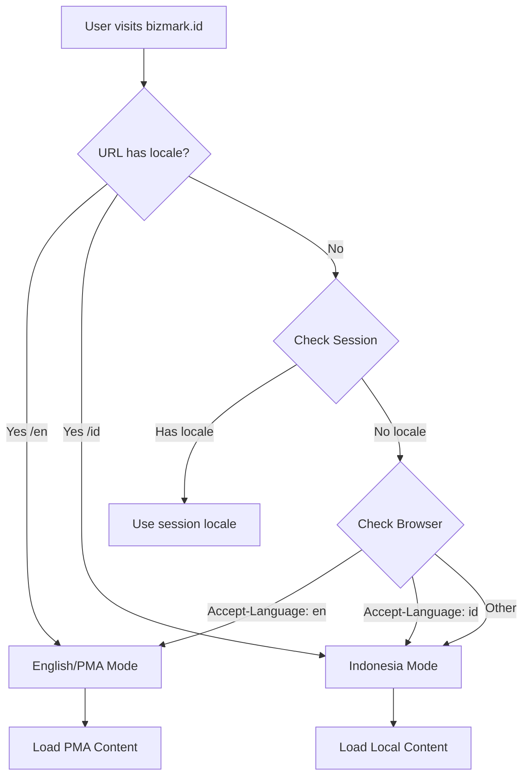

# 🚀 IMPLEMENTASI DUAL MARKET: PERENCANAAN TEKNIS

**Project:** Landing Page Dual Market (Local & PMA)  
**Timeline:** 6 Minggu  
**Start Date:** 6 Januari 2026  
**Target Launch:** 17 Februari 2026  

---

## 📋 TABLE OF CONTENTS

1. [Architecture Overview](#architecture-overview)
2. [Database Schema](#database-schema)
3. [File Structure](#file-structure)
4. [Routing Strategy](#routing-strategy)
5. [Translation System](#translation-system)
6. [Content Strategy](#content-strategy)
7. [Implementation Checklist](#implementation-checklist)
8. [Testing Plan](#testing-plan)
9. [Deployment Strategy](#deployment-strategy)

---

## 🏗️ ARCHITECTURE OVERVIEW

### Market Detection Flow



### Request Lifecycle

```
1. Route: GET /en
   ↓
2. Middleware: SetLocale
   - Session::put('locale', 'en')
   - App::setLocale('en')
   ↓
3. Controller: LandingController@index
   - Detect market: 'pma' or 'local'
   - Load config: services_pma.php or services_data.php
   ↓
4. View: landing.en.index
   - Use @lang() directives
   - Load PMA partials
   ↓
5. Response: Rendered HTML
```

---

## 🗄️ DATABASE SCHEMA

### No New Tables Required! ✅

Gunakan existing tables dengan enhancement:

#### 1. **clients** table
```sql
ALTER TABLE clients ADD COLUMN market_type ENUM('local', 'pma') DEFAULT 'local';
ALTER TABLE clients ADD COLUMN preferred_language VARCHAR(5) DEFAULT 'id';
ALTER TABLE clients ADD COLUMN country_code VARCHAR(3) NULL;
```

#### 2. **permit_applications** table
```sql
ALTER TABLE permit_applications ADD COLUMN market_segment VARCHAR(20) DEFAULT 'local';
ALTER TABLE permit_applications ADD COLUMN preferred_currency VARCHAR(3) DEFAULT 'IDR';
```

#### 3. **articles** table (untuk blog multi-bahasa)
```sql
ALTER TABLE articles ADD COLUMN language VARCHAR(5) DEFAULT 'id';
ALTER TABLE articles ADD COLUMN translation_id BIGINT UNSIGNED NULL;
ALTER TABLE articles ADD FOREIGN KEY (translation_id) REFERENCES articles(id);
```

---

## 📁 FILE STRUCTURE

### Phase 1: Core Files

```
app/
├── Http/
│   ├── Controllers/
│   │   ├── LandingController.php          # Update: market detection
│   │   ├── LocaleController.php           # Update: currency support
│   │   └── Landing/
│   │       ├── InvestmentController.php   # NEW: PMA-specific
│   │       └── PackageController.php      # NEW: PMA packages
│   │
│   └── Middleware/
│       ├── SetLocale.php                  # NEW: Auto locale detection
│       └── MarketSegment.php              # NEW: PMA vs Local

config/
├── landing.php                            # Existing: already multi-lang
├── services_data.php                      # Existing: local services
├── services_pma.php                       # NEW: PMA services
├── investment.php                         # NEW: PMA packages & pricing
└── markets.php                            # NEW: Market configurations

lang/
├── id/
│   ├── landing.php                        # Existing
│   ├── services.php                       # NEW
│   └── validation.php
│
└── en/
    ├── landing.php                        # NEW: Complete translations
    ├── services.php                       # NEW
    ├── investment.php                     # NEW: PMA-specific
    └── validation.php

resources/views/
├── landing/
│   ├── layout.blade.php                   # Update: locale-aware
│   │
│   ├── id/                                # Indonesian version
│   │   ├── index.blade.php
│   │   └── partials/
│   │       ├── hero.blade.php
│   │       ├── services.blade.php
│   │       ├── process.blade.php
│   │       ├── stats.blade.php
│   │       ├── testimonials.blade.php
│   │       ├── faq.blade.php
│   │       ├── clients.blade.php
│   │       └── contact.blade.php
│   │
│   └── en/                                # English/PMA version
│       ├── index.blade.php                # NEW
│       ├── investment.blade.php           # NEW: Investment guide
│       └── partials/
│           ├── hero.blade.php             # NEW
│           ├── services.blade.php         # NEW
│           ├── process.blade.php          # NEW
│           ├── stats.blade.php            # NEW
│           ├── testimonials.blade.php     # NEW
│           ├── faq.blade.php              # NEW
│           ├── packages.blade.php         # NEW: PMA packages
│           └── contact.blade.php          # NEW
│
└── components/
    ├── locale-switcher.blade.php          # NEW: Language selector
    └── currency-switcher.blade.php        # NEW: IDR/USD toggle

routes/
└── web.php                                # Update: locale routing
```

---

## 🛣️ ROUTING STRATEGY

### routes/web.php

```php
<?php

use App\Http\Controllers\LandingController;
use App\Http\Controllers\LocaleController;
use App\Http\Controllers\Landing\InvestmentController;

// Locale Switcher
Route::get('/locale/{locale}', [LocaleController::class, 'setLocale'])
    ->name('locale.set')
    ->where('locale', 'id|en');

// Root - Auto-detect
Route::get('/', [LandingController::class, 'index'])
    ->name('landing')
    ->middleware('detect.market');

// Indonesian (Explicit)
Route::prefix('id')->middleware('locale:id')->group(function () {
    Route::get('/', [LandingController::class, 'index'])->name('landing.id');
    Route::get('/layanan', [ServiceController::class, 'index'])->name('services.index.id');
    Route::get('/layanan/{slug}', [ServiceController::class, 'show'])->name('services.show.id');
    Route::get('/blog', [PublicArticleController::class, 'index'])->name('blog.index.id');
});

// English/PMA (Explicit)
Route::prefix('en')->middleware('locale:en')->group(function () {
    Route::get('/', [LandingController::class, 'index'])->name('landing.en');
    Route::get('/services', [ServiceController::class, 'index'])->name('services.index.en');
    Route::get('/services/{slug}', [ServiceController::class, 'show'])->name('services.show.en');
    Route::get('/investment', [InvestmentController::class, 'index'])->name('investment.index');
    Route::get('/investment/guide', [InvestmentController::class, 'guide'])->name('investment.guide');
    Route::get('/packages', [InvestmentController::class, 'packages'])->name('investment.packages');
    Route::get('/blog', [PublicArticleController::class, 'index'])->name('blog.index.en');
});

// Keep existing routes (backward compatibility)
Route::get('/blog', [PublicArticleController::class, 'index'])->name('blog.index');
Route::get('/blog/{slug}', [PublicArticleController::class, 'show'])->name('blog.article');
Route::get('/layanan', [ServiceController::class, 'index'])->name('services.index');
Route::get('/layanan/{slug}', [ServiceController::class, 'show'])->name('services.show');
```

---

## 🌐 TRANSLATION SYSTEM

### Middleware: SetLocale

**File:** `app/Http/Middleware/SetLocale.php`

```php
<?php

namespace App\Http\Middleware;

use Closure;
use Illuminate\Http\Request;
use Illuminate\Support\Facades\App;
use Illuminate\Support\Facades\Session;

class SetLocale
{
    public function handle(Request $request, Closure $next, $locale = null)
    {
        // Priority 1: Explicit locale from route parameter
        if ($locale && in_array($locale, ['id', 'en'])) {
            App::setLocale($locale);
            Session::put('locale', $locale);
            return $next($request);
        }
        
        // Priority 2: Session locale
        if (Session::has('locale')) {
            App::setLocale(Session::get('locale'));
            return $next($request);
        }
        
        // Priority 3: Browser Accept-Language
        $browserLang = $request->getPreferredLanguage(['id', 'en']);
        App::setLocale($browserLang ?? 'id');
        Session::put('locale', $browserLang ?? 'id');
        
        return $next($request);
    }
}
```

**Register in:** `app/Http/Kernel.php`

```php
protected $middlewareGroups = [
    'web' => [
        // ... existing middleware
        \App\Http\Middleware\SetLocale::class,
    ],
];

protected $routeMiddleware = [
    // ... existing middleware
    'locale' => \App\Http\Middleware\SetLocale::class,
];
```

---

### Translation Files

#### lang/en/landing.php

```php
<?php

return [
    'meta' => [
        'title' => 'Bizmark.ID - Business Consulting & Investment Services in Indonesia',
        'description' => 'Your trusted partner for business establishment, investment permits, and regulatory compliance in Indonesia. We serve foreign investors and multinational companies.',
        'keywords' => 'indonesia investment, business permit, pma establishment, company setup indonesia, foreign investment indonesia, bkpm permit, kitas work permit',
    ],
    
    'nav' => [
        'home' => 'Home',
        'services' => 'Services',
        'process' => 'Process',
        'about' => 'About',
        'blog' => 'Blog',
        'contact' => 'Contact',
        'language' => 'Language',
        'get_started' => 'Get Started',
    ],
    
    'hero' => [
        'badge' => 'Trusted Business Partner',
        'title' => 'Navigate Indonesian Regulations with Confidence',
        'subtitle' => 'We handle investment permits, business establishment, and compliance for foreign investors and multinational companies in Indonesia.',
        'cta_primary' => 'Schedule Consultation',
        'cta_secondary' => 'Investment Guide',
        'trust_badge' => 'Trusted by 50+ international companies from 15+ countries',
    ],
    
    'stats' => [
        'clients' => [
            'value' => '50+',
            'label' => 'International Clients',
            'description' => 'From 15+ countries across Asia, Europe, and Americas',
        ],
        'experience' => [
            'value' => '12+',
            'label' => 'Years Experience',
            'description' => 'Cross-border compliance specialists since 2013',
        ],
        'success_rate' => [
            'value' => '98%',
            'label' => 'Success Rate',
            'description' => 'Permits approved on first submission',
        ],
        'iso_certified' => [
            'value' => 'ISO 9001',
            'label' => 'Certified',
            'description' => 'Quality management standards',
        ],
    ],
    
    'services' => [
        'title' => 'Investment Services',
        'subtitle' => 'End-to-end solutions for foreign direct investment in Indonesia',
        'view_all' => 'View All Services',
    ],
    
    'process' => [
        'title' => 'Our Process',
        'subtitle' => 'Transparent, efficient, and compliant every step of the way',
    ],
    
    'testimonials' => [
        'title' => 'What Our Clients Say',
        'subtitle' => 'Trusted by leading international companies',
    ],
    
    'faq' => [
        'title' => 'Frequently Asked Questions',
        'subtitle' => 'Everything you need to know about investing in Indonesia',
    ],
    
    'contact' => [
        'title' => 'Ready to Invest in Indonesia?',
        'subtitle' => 'Our team is ready to help you navigate the process',
        'email' => 'Email Us',
        'phone' => 'Call Us',
        'office' => 'Visit Office',
        'hours' => 'Mon-Fri: 08:00-17:00 WIB',
    ],
    
    'footer' => [
        'tagline' => 'Your trusted business partner in Indonesia',
        'copyright' => 'All rights reserved.',
        'navigation' => 'Navigation',
        'contact_us' => 'Contact Us',
        'legal' => 'Legal',
    ],
];
```

---

#### lang/en/investment.php

```php
<?php

return [
    'packages' => [
        'starter' => [
            'name' => 'Starter Package',
            'price' => 'USD 3,500',
            'duration' => '30 days',
            'description' => 'Perfect for small foreign-owned businesses',
            'features' => [
                'Company establishment (PT PMA)',
                'Tax registration (NPWP)',
                'Business license (NIB)',
                '1 work permit (KITAS)',
                'Bank account opening support',
                'Free consultation (1 hour)',
            ],
        ],
        
        'business' => [
            'name' => 'Business Package',
            'price' => 'USD 8,500',
            'duration' => '60 days',
            'description' => 'Comprehensive setup for medium-sized operations',
            'features' => [
                'Everything in Starter',
                'BKPM investment approval',
                'Environmental permit (UKL-UPL)',
                'Import license',
                '3 work permits (KITAS)',
                'Office lease negotiation',
                'Free compliance review',
            ],
            'popular' => true,
        ],
        
        'enterprise' => [
            'name' => 'Enterprise Package',
            'price' => 'From USD 15,000',
            'duration' => '90+ days',
            'description' => 'Full-service solution for large investments',
            'features' => [
                'Everything in Business',
                'Full compliance setup',
                'Land acquisition support',
                'AMDAL (if required)',
                '5+ work permits',
                'Ongoing support (3 months)',
                'Dedicated account manager',
            ],
        ],
    ],
    
    'faq' => [
        'timeline' => [
            'question' => 'What is the timeline for PMA establishment?',
            'answer' => 'A basic PT PMA can be established in 30-45 days, including company registration, tax ID, and business license. Additional permits like environmental or sector-specific licenses may take 60-180 days depending on complexity.',
        ],
        
        'capital' => [
            'question' => 'What are the minimum capital requirements?',
            'answer' => 'For most sectors, the minimum paid-up capital is IDR 10 billion (approximately USD 650,000). However, this varies by sector and business activity. Some sectors have lower requirements, while strategic sectors may require more.',
        ],
        
        'ownership' => [
            'question' => 'Can I have 100% foreign ownership?',
            'answer' => 'It depends on the business sector. Indonesia maintains a Negative Investment List (DNI) that restricts or limits foreign ownership in certain sectors. Many sectors allow 100% foreign ownership, while others require Indonesian partnership. We help you navigate these regulations.',
        ],
        
        'work_permits' => [
            'question' => 'How do we handle visas and work permits for expatriates?',
            'answer' => 'We handle the entire process: IMTA (work permit) application, KITAS/KITAP processing, and MERP registration. Processing time is typically 14-21 working days. We also provide ongoing support for renewals and family dependents.',
        ],
        
        'taxes' => [
            'question' => 'What are the tax implications for foreign investors?',
            'answer' => 'Indonesia has a corporate tax rate of 22% (reducing to 20% in 2023). Tax treaties with many countries prevent double taxation. We can help structure your investment for tax efficiency and apply for available incentives in special economic zones.',
        ],
        
        'compliance' => [
            'question' => 'Do you provide ongoing compliance services?',
            'answer' => 'Yes, we offer annual retainer packages starting from USD 500/month covering permit renewals, regulatory updates, annual reporting, and general compliance advisory.',
        ],
        
        'restrictions' => [
            'question' => 'What sectors have foreign investment restrictions?',
            'answer' => 'Restricted sectors include retail (certain types), small-scale mining, traditional fisheries, broadcasting, and some professional services. We have detailed knowledge of the Negative Investment List and can advise on alternative structures.',
        ],
        
        'repatriation' => [
            'question' => 'How do we repatriate profits?',
            'answer' => 'Profit repatriation is permitted after fulfilling tax obligations. Dividends can be remitted abroad through authorized banks. We assist with tax clearance documentation and ensure compliance with Bank Indonesia regulations.',
        ],
    ],
];
```

---

## 📝 CONTENT STRATEGY

### PMA Services Configuration

**File:** `config/services_pma.php`

```php
<?php

return [
    'investment-registration' => [
        'title' => 'Investment Registration (BKPM)',
        'slug' => 'investment-registration',
        'short_description' => 'Foreign Direct Investment (PMA) approval and business license coordination',
        'icon' => 'fa-handshake',
        'color' => '#1E40AF',
        'meta_keywords' => 'bkpm approval, pma registration, foreign investment indonesia, investment permit',
        'category' => 'INVESTMENT',
        'pricing' => [
            'min' => 5000,
            'max' => 15000,
            'currency' => 'USD',
            'display' => 'USD 5,000 - 15,000',
        ],
        'duration' => '30-45 days',
        'description' => 'We handle the complete BKPM approval process for your foreign direct investment, ensuring compliance with Indonesian regulations and investment requirements.',
        'deliverables' => [
            'Investment principle approval',
            'Business identification number (NIB)',
            'Investment realization report setup',
            'Coordination with sector ministries',
        ],
        'requirements' => [
            'Company profile',
            'Business plan',
            'Capital proof',
            'Shareholder documents',
            'Feasibility study (if applicable)',
        ],
    ],
    
    'company-establishment' => [
        'title' => 'Company Establishment (PT PMA)',
        'slug' => 'company-establishment',
        'short_description' => 'Complete PT PMA incorporation including deed, ministry approval, and registration',
        'icon' => 'fa-building',
        'color' => '#DC2626',
        'meta_keywords' => 'pt pma setup, company incorporation indonesia, business registration',
        'category' => 'LEGAL',
        'pricing' => [
            'min' => 3500,
            'max' => 8000,
            'currency' => 'USD',
            'display' => 'USD 3,500 - 8,000',
        ],
        'duration' => '14-30 days',
        'description' => 'End-to-end company establishment services including notary deed preparation, Ministry of Law approval, and all necessary registrations.',
        'deliverables' => [
            'Deed of establishment',
            'Ministry of Law decree',
            'Company registration certificate',
            'Articles of association',
            'Board resolution templates',
        ],
        'requirements' => [
            'Passport copies of shareholders/directors',
            'Company name options (3)',
            'Capital structure plan',
            'Address proof',
        ],
    ],
    
    'tax-fiscal' => [
        'title' => 'Tax & Fiscal Permits',
        'slug' => 'tax-fiscal',
        'short_description' => 'NPWP, PKP registration, and tax incentive applications',
        'icon' => 'fa-calculator',
        'color' => '#0891B2',
        'meta_keywords' => 'npwp registration, tax id indonesia, vat registration, tax incentives',
        'category' => 'TAX',
        'pricing' => [
            'min' => 800,
            'max' => 2500,
            'currency' => 'USD',
            'display' => 'USD 800 - 2,500',
        ],
        'duration' => '7-14 days',
        'description' => 'Complete tax registration and compliance setup including NPWP, PKP, and exploration of available tax incentives.',
        'deliverables' => [
            'NPWP (Tax ID) for company',
            'PKP (VAT registration) if applicable',
            'Tax incentive assessment',
            'E-tax system setup',
        ],
        'requirements' => [
            'Company decree',
            'NIB',
            'Director ID documents',
            'Office address proof',
        ],
    ],
    
    'immigration-services' => [
        'title' => 'Immigration & Work Permits',
        'slug' => 'immigration-services',
        'short_description' => 'IMTA, KITAS/KITAP, and expatriate management services',
        'icon' => 'fa-passport',
        'color' => '#9333EA',
        'meta_keywords' => 'work permit indonesia, kitas, kitap, imta, expatriate visa',
        'category' => 'IMMIGRATION',
        'pricing' => [
            'min' => 1500,
            'max' => 4000,
            'currency' => 'USD',
            'display' => 'USD 1,500 - 4,000 per permit',
        ],
        'duration' => '14-21 days',
        'description' => 'Full immigration support for foreign employees including work permits, residence permits, and family dependents.',
        'deliverables' => [
            'IMTA (work permit approval)',
            'KITAS (limited stay permit)',
            'MERP registration',
            'DP5 notification',
            'Renewal reminders',
        ],
        'requirements' => [
            'Passport (min 18 months validity)',
            'CV and diploma',
            'Employment contract',
            'Recent photo',
            'Health insurance proof',
        ],
    ],
    
    'environmental-compliance' => [
        'title' => 'Environmental Compliance',
        'slug' => 'environmental-compliance',
        'short_description' => 'AMDAL/UKL-UPL with international standards, ISO 14001 consultation',
        'icon' => 'fa-leaf',
        'color' => '#059669',
        'meta_keywords' => 'amdal indonesia, environmental permit, ukl upl, iso 14001, environmental compliance',
        'category' => 'ENVIRONMENT',
        'pricing' => [
            'min' => 8000,
            'max' => 50000,
            'currency' => 'USD',
            'display' => 'USD 8,000 - 50,000',
        ],
        'duration' => '60-180 days',
        'description' => 'Environmental impact assessment and permit processing following Indonesian regulations and international best practices.',
        'deliverables' => [
            'AMDAL or UKL-UPL document',
            'Environmental permit approval',
            'Environmental monitoring plan',
            'ISO 14001 readiness assessment',
        ],
        'requirements' => [
            'Project technical details',
            'Location map',
            'Process flow diagram',
            'Waste management plan',
        ],
    ],
    
    'land-building' => [
        'title' => 'Land & Building Permits',
        'slug' => 'land-building',
        'short_description' => 'Land acquisition support, PBG, and SLF for foreign investors',
        'icon' => 'fa-home',
        'color' => '#F59E0B',
        'meta_keywords' => 'land permit indonesia, building permit, pbg, slf, construction permit',
        'category' => 'PROPERTY',
        'pricing' => [
            'min' => 5000,
            'max' => 25000,
            'currency' => 'USD',
            'display' => 'USD 5,000 - 25,000',
        ],
        'duration' => '30-90 days',
        'description' => 'Complete land acquisition advisory and building permit services tailored for foreign investors and developers.',
        'deliverables' => [
            'Land due diligence report',
            'Building permit (PBG)',
            'Building safety certificate (SLF)',
            'Location permit',
        ],
        'requirements' => [
            'Land certificate',
            'Building plans',
            'Technical specifications',
            'Environmental clearance',
        ],
    ],
    
    'operational-licenses' => [
        'title' => 'Operational Licenses',
        'slug' => 'operational-licenses',
        'short_description' => 'Sector-specific permits, import/export licenses, product registration',
        'icon' => 'fa-certificate',
        'color' => '#EC4899',
        'meta_keywords' => 'operational license indonesia, import permit, export license, sector permit',
        'category' => 'OPERATIONS',
        'pricing' => [
            'min' => 2000,
            'max' => 15000,
            'currency' => 'USD',
            'display' => 'USD 2,000 - 15,000',
        ],
        'duration' => 'Varies by sector',
        'description' => 'Specialized operational permits based on your business sector including manufacturing, trading, and service industries.',
        'deliverables' => [
            'Sector-specific operational license',
            'Import identification number (API)',
            'Product registration (if applicable)',
            'Standards certification support',
        ],
        'requirements' => [
            'Company registration documents',
            'NIB',
            'Technical specifications',
            'Quality certificates',
        ],
    ],
    
    'ongoing-compliance' => [
        'title' => 'Ongoing Compliance & Support',
        'slug' => 'ongoing-compliance',
        'short_description' => 'Annual retainer for permit renewals, reporting, and regulatory updates',
        'icon' => 'fa-sync',
        'color' => '#14B8A6',
        'meta_keywords' => 'compliance retainer, permit renewal, regulatory updates, annual reporting',
        'category' => 'COMPLIANCE',
        'pricing' => [
            'min' => 500,
            'max' => 2000,
            'currency' => 'USD',
            'display' => 'USD 500 - 2,000/month',
        ],
        'duration' => 'Ongoing (monthly retainer)',
        'description' => 'Dedicated compliance support ensuring all permits stay current and your business remains compliant with changing regulations.',
        'deliverables' => [
            'Permit renewal management',
            'Annual reporting assistance',
            'Regulatory change alerts',
            'Quarterly compliance review',
            'Priority support access',
        ],
        'requirements' => [
            'Existing permits documentation',
            'Company calendar',
            'Primary contact designation',
        ],
    ],
];
```

---

## ✅ IMPLEMENTATION CHECKLIST

### Week 1: Foundation (Jan 6-10)

#### Day 1-2: Setup & Configuration
- [ ] Create `config/services_pma.php` with 8 services
- [ ] Create `config/investment.php` with packages
- [ ] Create `config/markets.php` for market settings
- [ ] Create migration for clients table (market_type, preferred_language)
- [ ] Create migration for permit_applications (market_segment, currency)
- [ ] Run migrations

#### Day 3-4: Middleware & Routing
- [ ] Create `SetLocale` middleware
- [ ] Create `MarketSegment` middleware
- [ ] Update `Kernel.php` with new middleware
- [ ] Update `routes/web.php` with locale routing
- [ ] Test locale detection logic
- [ ] Test session persistence

#### Day 5: Translation Files
- [ ] Create `lang/en/landing.php` (complete)
- [ ] Create `lang/en/services.php`
- [ ] Create `lang/en/investment.php`
- [ ] Create `lang/en/validation.php`
- [ ] Review all translations with native speaker

---

### Week 2: Content & Services (Jan 13-17)

#### Day 1-2: PMA Service Pages
- [ ] Write detailed descriptions for all 8 PMA services
- [ ] Create pricing tables (USD)
- [ ] Define deliverables for each service
- [ ] Create requirements checklists
- [ ] Prepare process timelines

#### Day 3: Investment Packages
- [ ] Define 3 package tiers (Starter, Business, Enterprise)
- [ ] Create feature comparison matrix
- [ ] Write package descriptions
- [ ] Design package pricing display
- [ ] Create package benefits list

#### Day 4: FAQ Content
- [ ] Write 8 PMA-specific FAQ items
- [ ] Create investment guide outline
- [ ] Prepare compliance documentation
- [ ] Create sector restriction guide

#### Day 5: Testimonials & Case Studies
- [ ] Collect international client testimonials (target: 5)
- [ ] Create case study templates
- [ ] Prepare client logos (with permission)
- [ ] Write success stories (2-3 detailed)

---

### Week 3: UI Development (Jan 20-24)

#### Day 1: Layout & Components
- [ ] Update `landing/layout.blade.php` for locale detection
- [ ] Create `components/locale-switcher.blade.php`
- [ ] Create `components/currency-display.blade.php`
- [ ] Create `components/market-badge.blade.php`
- [ ] Test responsive behavior

#### Day 2-3: English Landing Page
- [ ] Create `landing/en/index.blade.php`
- [ ] Create `landing/en/partials/hero.blade.php`
- [ ] Create `landing/en/partials/services.blade.php`
- [ ] Create `landing/en/partials/process.blade.php`
- [ ] Create `landing/en/partials/stats.blade.php`
- [ ] Create `landing/en/partials/testimonials.blade.php`
- [ ] Create `landing/en/partials/faq.blade.php`
- [ ] Create `landing/en/partials/contact.blade.php`

#### Day 4: Investment Pages
- [ ] Create `landing/en/investment.blade.php` (guide)
- [ ] Create `landing/en/partials/packages.blade.php`
- [ ] Create service detail pages (8 services)

#### Day 5: Testing & Polish
- [ ] Cross-browser testing (Chrome, Firefox, Safari, Edge)
- [ ] Mobile responsive testing (iOS, Android)
- [ ] Locale switcher UX testing
- [ ] Navigation testing
- [ ] Fix bugs and inconsistencies

---

### Week 4: Forms & Functionality (Jan 27-31)

#### Day 1-2: PMA Consultation Form
- [ ] Create `InvestmentController.php`
- [ ] Create multi-step consultation form
- [ ] Add investment amount field (USD)
- [ ] Add sector selection
- [ ] Add nationality field
- [ ] Implement form validation (EN)

#### Day 3: Email System
- [ ] Create email templates (EN)
- [ ] Update `NewApplicationNotification` for PMA
- [ ] Create `InvestmentInquiryMail`
- [ ] Test email delivery
- [ ] Test email formatting

#### Day 4: Lead Management
- [ ] Update admin panel for PMA leads
- [ ] Create market segment filter
- [ ] Add currency display (USD/IDR)
- [ ] Create PMA lead dashboard
- [ ] Test lead assignment

#### Day 5: Integration Testing
- [ ] Test end-to-end consultation flow
- [ ] Test email notifications
- [ ] Test admin workflow
- [ ] Test data persistence
- [ ] Fix integration issues

---

### Week 5: SEO & Marketing (Feb 3-7)

#### Day 1-2: SEO Optimization
- [ ] Create English meta tags
- [ ] Implement hreflang tags
- [ ] Update sitemap.xml (EN pages)
- [ ] Create robots.txt rules
- [ ] Submit to Google Search Console

#### Day 3: Analytics Setup
- [ ] Create GA4 events for PMA pages
- [ ] Set up conversion tracking
- [ ] Create locale-based segments
- [ ] Configure goal tracking
- [ ] Test analytics data

#### Day 4: Content Marketing
- [ ] Write 3 English blog articles
- [ ] Create investment guide PDF
- [ ] Create sector restriction guide
- [ ] Prepare email drip campaign

#### Day 5: Marketing Assets
- [ ] Create PMA landing page ads (Google)
- [ ] Create LinkedIn ads
- [ ] Create Facebook ads (English)
- [ ] Prepare email templates
- [ ] Create social media graphics

---

### Week 6: Testing & Launch (Feb 10-17)

#### Day 1-2: QA Testing
- [ ] Full functionality testing
- [ ] Performance testing (page load)
- [ ] Security testing
- [ ] Accessibility testing (WCAG)
- [ ] Fix all critical bugs

#### Day 3: User Acceptance Testing
- [ ] Internal team review
- [ ] Stakeholder walkthrough
- [ ] Collect feedback
- [ ] Make final adjustments

#### Day 4: Pre-Launch Prep
- [ ] Final content review
- [ ] Database backup
- [ ] Create rollback plan
- [ ] Prepare launch announcement
- [ ] Brief customer support team

#### Day 5: Launch! 🚀
- [ ] Deploy to production
- [ ] Monitor server performance
- [ ] Monitor error logs
- [ ] Track initial traffic
- [ ] Celebrate success! 🎉

---

## 🧪 TESTING PLAN

### Unit Tests

```php
// tests/Feature/LocaleTest.php
public function test_locale_switches_correctly()
{
    $response = $this->get('/locale/en');
    $this->assertEquals('en', session('locale'));
    
    $response = $this->get('/locale/id');
    $this->assertEquals('id', session('locale'));
}

public function test_english_landing_page_loads()
{
    $response = $this->get('/en');
    $response->assertStatus(200);
    $response->assertViewIs('landing.en.index');
}

public function test_pma_services_load_correctly()
{
    $response = $this->get('/en/services');
    $response->assertStatus(200);
    $response->assertSee('Investment Registration');
}
```

### Browser Testing Checklist

| Test Case | Chrome | Firefox | Safari | Edge | Mobile |
|-----------|--------|---------|--------|------|--------|
| Locale switcher works | [ ] | [ ] | [ ] | [ ] | [ ] |
| PMA pages load | [ ] | [ ] | [ ] | [ ] | [ ] |
| Forms submit | [ ] | [ ] | [ ] | [ ] | [ ] |
| Currency displays correctly | [ ] | [ ] | [ ] | [ ] | [ ] |
| Responsive layout | [ ] | [ ] | [ ] | [ ] | [ ] |
| Navigation works | [ ] | [ ] | [ ] | [ ] | [ ] |

---

## 🚀 DEPLOYMENT STRATEGY

### Pre-Deployment

```bash
# 1. Run tests
php artisan test

# 2. Clear caches
php artisan config:clear
php artisan cache:clear
php artisan view:clear
php artisan route:clear

# 3. Optimize
php artisan config:cache
php artisan route:cache
php artisan view:cache

# 4. Run migrations (if any)
php artisan migrate --force

# 5. Seed PMA data
php artisan db:seed --class=PmaServicesSeeder
```

### Deployment Steps

```bash
# 1. Backup database
php artisan backup:run

# 2. Pull latest code
git pull origin main

# 3. Install dependencies
composer install --no-dev --optimize-autoloader

# 4. Run migrations
php artisan migrate --force

# 5. Clear and cache
php artisan optimize

# 6. Restart queues
php artisan queue:restart

# 7. Restart server (if needed)
sudo systemctl restart php8.2-fpm
sudo systemctl restart nginx
```

### Post-Deployment Monitoring

```bash
# Monitor logs
tail -f storage/logs/laravel.log

# Monitor server
htop

# Check error rate
cat storage/logs/laravel.log | grep ERROR | wc -l

# Check response time
curl -w "@curl-format.txt" -o /dev/null -s https://bizmark.id/en
```

---

## 📊 SUCCESS CRITERIA

### Technical Metrics
- [ ] Page load time < 2 seconds
- [ ] Lighthouse score > 90
- [ ] Zero critical bugs
- [ ] 100% uptime during launch week

### Business Metrics
- [ ] 5+ PMA consultation requests in first month
- [ ] 10% traffic from English pages
- [ ] 3% conversion rate (EN visitors → leads)
- [ ] Average project value > USD 5,000

---

## 📞 SUPPORT & ESCALATION

### Development Team
- **Lead Developer**: [Name]
- **Frontend Developer**: [Name]
- **QA Tester**: [Name]

### Business Team
- **Project Manager**: [Name]
- **Content Writer (EN)**: [Name]
- **Marketing Lead**: [Name]

### Escalation Path
1. **Minor issues**: Developer → Lead Dev (4 hours)
2. **Major issues**: Lead Dev → CTO (1 hour)
3. **Critical issues**: Immediate escalation to all stakeholders

---

## ✅ FINAL CHECKLIST

Before marking this project complete:

- [ ] All 8 PMA services documented and live
- [ ] English landing page fully functional
- [ ] Locale switcher tested and working
- [ ] SEO implemented (hreflang, meta, sitemap)
- [ ] Analytics tracking configured
- [ ] Email notifications working (EN & ID)
- [ ] Forms validated and tested
- [ ] Mobile responsive on all pages
- [ ] Cross-browser compatibility verified
- [ ] Performance benchmarks met
- [ ] Documentation complete
- [ ] Team trained on new features
- [ ] Launch announcement sent
- [ ] Monitoring dashboard configured

---

**Last Updated:** 3 Januari 2026  
**Version:** 1.0  
**Status:** Ready for Implementation 🚀
