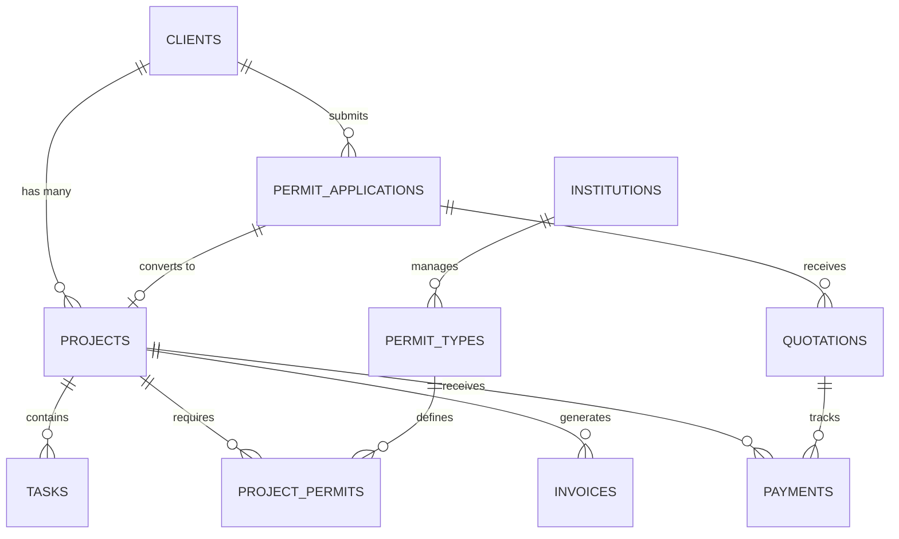

<div align="center"># BizMark.ID - Business Management System# BizMark.ID - Business Management System<p align="center"><a href="https://laravel.com" target="_blank"></a></p>


# 🏢 BizMark.ID


### Sistem Manajemen Bisnis Konsultan Perizinan[](CHANGELOG.md)


[](https://gitlab.com/bizmark.id/beta-testing)[](https://laravel.com)

[](https://laravel.com)

[](https://php.net)[](docs/SECURITY_IMPROVEMENTS.md)[](CHANGELOG.md)<p align="center">

[](https://postgresql.org)

[](LICENSE)[](docs/SECURITY_IMPROVEMENTS.md)


**Platform terintegrasi untuk mengelola proyek perizinan, keuangan, SDM, dan layanan konsultasi berbasis AI**[](docs/DARK_MODE.md)[](https://laravel.com)<a href="https://github.com/laravel/framework/actions"></a>


[🌐 Website](https://bizmark.id) · [📖 Dokumentasi](docs/) · [🐛 Laporkan Bug](https://gitlab.com/bizmark.id/beta-testing/-/issues) · [💡 Request Fitur](https://gitlab.com/bizmark.id/beta-testing/-/issues/new)


</div>> Sistem administrasi pengelolaan pekerjaan untuk konsultan perizinan dengan fokus pada **keamanan**, **aksesibilitas**, **performa**, dan **dark mode gelap doff**.[](docs/SECURITY_IMPROVEMENTS.md)<a href="https://packagist.org/packages/laravel/framework"></a>


---


## 📑 Daftar Isi---[](docs/SECURITY_IMPROVEMENTS.md)<a href="https://packagist.org/packages/laravel/framework"></a>


- [Tentang Sistem](#-tentang-sistem)

- [Fitur Utama](#-fitur-utama)

- [Teknologi](#-teknologi)## ✨ Fitur Utama<a href="https://packagist.org/packages/laravel/framework"></a>

- [Arsitektur Database](#-arsitektur-database)

- [Instalasi](#-instalasi)

- [Konfigurasi](#-konfigurasi)

- [API Documentation](#-api-documentation)### 🎯 Manajemen Proyek & Perizinan> Sistem administrasi pengelolaan pekerjaan untuk konsultan perizinan dengan fokus pada **keamanan**, **aksesibilitas**, dan **performa**.</p>

- [Testing](#-testing)

- [Deployment](#-deployment)- Dashboard real-time dengan statistik dan grafik

- [Kontribusi](#-kontribusi)

- Grid/List view untuk Projects dan Tasks

---

- Status tracking dan workflow management

## 🎯 Tentang Sistem

---## About Laravel

**BizMark.ID** adalah sistem manajemen bisnis komprehensif yang dirancang khusus untuk perusahaan konsultan perizinan dan legalitas. Sistem ini mengintegrasikan seluruh proses bisnis mulai dari akuisisi klien, manajemen proyek, keuangan, hingga pelaporan dalam satu platform yang aman dan efisien.

### 📄 Manajemen Dokumen

### 🌟 Keunggulan

- Upload/download dokumen dengan kategori

- 🤖 **AI-Powered**: Konsultasi otomatis dengan Claude 3.5 Sonnet

- 🔒 **Enterprise Security**: CSP headers, CSRF protection, role-based access control- Pencarian dan filtering

- 📱 **Progressive Web App**: Install sebagai aplikasi mobile dengan offline support

- 🌍 **Multi-language**: Indonesia & English dengan i18n support- Secure storage dengan access control## 📚 Daftar IsiLaravel is a web application framework with expressive, elegant syntax. We believe development must be an enjoyable and creative experience to be truly fulfilling. Laravel takes the pain out of development by easing common tasks used in many web projects, such as:

- 📊 **Real-time Analytics**: Dashboard interaktif dengan Chart.js

- 📄 **Document Management**: Version control, template system, digital signature

- 💰 **Financial Integration**: Midtrans payment gateway, bank reconciliation

- 👥 **ATS System**: Recruitment & interview management terintegrasi### ✅ Manajemen Tugas


---- Task assignment dengan due dates


## ✨ Fitur Utama- Priority levels & status tracking- [Fitur Utama](#-fitur-utama)- [Simple, fast routing engine](https://laravel.com/docs/routing).


### 🎯 Manajemen Proyek & Perizinan- Dual view: Grid & List


<details>- [Teknologi](#-teknologi)- [Powerful dependency injection container](https://laravel.com/docs/container).

<summary><b>Lihat Detail Fitur</b></summary>

### 🌓 Dark Mode - Warna Gelap Doff

- **Project Management**

  - Dashboard real-time dengan visualisasi KPI- **NEW!** Complete dark mode implementation- [Instalasi](#-instalasi)- Multiple back-ends for [session](https://laravel.com/docs/session) and [cache](https://laravel.com/docs/cache) storage.

  - Grid & List view dengan sorting/filtering

  - Timeline tracking & milestone management- Warna gelap doff/matte (#1a1a1a) - nyaman untuk mata

  - Permit workflow dengan 9 status (NOT_STARTED → APPROVED)

  - Document version control & sharing- Soft shadows dan subtle borders- [Keamanan](#-keamanan)- Expressive, intuitive [database ORM](https://laravel.com/docs/eloquent).

  - Project templates untuk permit types berbeda

  - Cost estimation & budget tracking- WCAG 2.1 AA compliant

  

- **Permit Application System**- Apple dark mode color variants- [Aksesibilitas](#-aksesibilitas)- Database agnostic [schema migrations](https://laravel.com/docs/migrations).

  - Client self-service portal

  - Dynamic form builder berdasarkan permit type

  - Multi-file document upload dengan verification

  - Quotation system dengan breakdown biaya---- [Performance](#-performance)- [Robust background job processing](https://laravel.com/docs/queues).

  - Payment integration (DP → Termin → Pelunasan)

  - Application to project conversion

  - Status tracking & notifications

  ## 🛠️ Teknologi- [Dokumentasi](#-dokumentasi)- [Real-time event broadcasting](https://laravel.com/docs/broadcasting).

- **KBLI Integration**

  - 1.790 kode KBLI database

  - AI-powered permit recommendation

  - Compliance checker- **Backend**: Laravel 10.x + PHP 8.1+

  - Usage analytics

- **Frontend**: Tailwind CSS (Dark Mode) + Chart.js

</details>

- **Database**: MySQL/PostgreSQL---Laravel is accessible, powerful, and provides tools required for large, robust applications.

### 💼 Manajemen Klien & CRM

- **Security**: CSP-compliant, WCAG 2.1 AA

<details>

<summary><b>Lihat Detail Fitur</b></summary>- **Performance**: View Composer + Cache (75% less queries)


- **Client Portal**- **Design**: Apple Human Interface Guidelines

  - Self-registration dengan email verification

  - Service catalog dengan estimasi biaya## ✨ Fitur Utama## Learning Laravel

  - Application submission & tracking

  - Document upload & management---

  - Payment status monitoring

  - Notification center

  

- **Service Inquiry System**## 🌓 Dark Mode

  - Landing page inquiry form

  - WhatsApp & Email integration### 🎯 Manajemen Proyek & PerizinanLaravel has the most extensive and thorough [documentation](https://laravel.com/docs) and video tutorial library of all modern web application frameworks, making it a breeze to get started with the framework.

  - Lead scoring & prioritization

  - Conversion tracking### Color Palette (Gelap Doff)

  - Rate limiting & anti-spam

```- Dashboard real-time dengan statistik dan grafik

- **AI Consultation Tool** ⭐ NEW

  - KBLI-based business analysisBackground:        #1a1a1a (dark-bg)

  - Automatic permit requirement detection

  - Cost estimation (Rp 5M - Rp 150M+)Surface/Cards:     #252525 (dark-surface)- Grid/List view untuk Projects dan TasksYou may also try the [Laravel Bootcamp](https://bootcamp.laravel.com), where you will be guided through building a modern Laravel application from scratch.

  - Processing time prediction (30-90 hari)

  - Deliverables recommendationElevated:          #2d2d2d (dark-elevated)

  - Investment level assessment

Border:            #3a3a3a (dark-border)- Status tracking dan workflow management

</details>

Text Primary:      #e5e5e5 (dark-text)

### 💰 Manajemen Keuangan

Text Secondary:    #a0a0a0- Timeline dan milestone trackingIf you don't feel like reading, [Laracasts](https://laracasts.com) can help. Laracasts contains thousands of video tutorials on a range of topics including Laravel, modern PHP, unit testing, and JavaScript. Boost your skills by digging into our comprehensive video library.

<details>

<summary><b>Lihat Detail Fitur</b></summary>```


- **Financial Tracking**

  - Project-based income & expense

  - General ledger dengan cash accounts### Karakteristik

  - Invoice generation & management

  - Payment schedule & reminders- ✅ Tidak terlalu kontras (nyaman mata)### 📄 Manajemen Dokumen## Laravel Sponsors

  - Revenue recognition

  - Profit & loss reporting- ✅ Soft shadows (tidak harsh)

  

- **Payment Gateway**- ✅ Subtle borders- Upload/download dokumen dengan kategori

  - Midtrans integration (Credit Card, E-wallet, VA)

  - Manual bank transfer dengan proof upload- ✅ Muted text (bukan pure white)

  - Multi-payment support (DP + installments)

  - Payment verification workflow- ✅ Apple dark colors variants- Pencarian dan filteringWe would like to extend our thanks to the following sponsors for funding Laravel development. If you are interested in becoming a sponsor, please visit the [Laravel Partners program](https://partners.laravel.com).

  - Refund management

  

- **Bank Reconciliation**

  - Auto-import CSV (BCA, Mandiri, BRI, BNI)**Detail**: Lihat [DARK_MODE.md](docs/DARK_MODE.md)- Secure storage dengan access control

  - Smart matching algorithm

  - Manual reconciliation tools

  - Discrepancy reporting

  - Audit trail---### Premium Partners


</details>


### 👥 Manajemen SDM & Recruitment## 📦 Instalasi### ✅ Manajemen Tugas


<details>

<summary><b>Lihat Detail Fitur</b></summary>

```bash- Task assignment dengan due dates- **[Vehikl](https://vehikl.com)**

- **Applicant Tracking System (ATS)**

  - Job vacancy posting dengan SEO optimization# Clone repository

  - Public career portal

  - Online application formgit clone https://github.com/yourusername/bizmark.id.git- Priority levels (urgent, high, normal, low)- **[Tighten Co.](https://tighten.co)**

  - Resume/CV parsing

  - Application status pipelinecd bizmark.id

  - Bulk actions & filters

  - Status tracking (todo, in progress, done, blocked)- **[Kirschbaum Development Group](https://kirschbaumdevelopment.com)**

- **Interview Management**

  - Schedule management dengan calendar sync# Install dependencies

  - Email notifications (candidate & interviewer)

  - Video interview integrationcomposer install- Dual view: Grid & List- **[64 Robots](https://64robots.com)**

  - Feedback & scoring system

  - Collaborative decision making

  

- **Technical Test System**# Setup environment- **[Curotec](https://www.curotec.com/services/technologies/laravel)**

  - Test template builder

  - Multiple choice & essay questionscp .env.example .env

  - Auto-grading untuk MCQ

  - Manual grading dengan rubricphp artisan key:generate### 🏢 Manajemen Institusi- **[DevSquad](https://devsquad.com/hire-laravel-developers)**

  - Test analytics & statistics


</details>

# Run migrations- Database institusi partner- **[Redberry](https://redberry.international/laravel-development)**

### 📄 Manajemen Dokumen

php artisan migrate --seed

<details>

<summary><b>Lihat Detail Fitur</b></summary>- Contact management- **[Active Logic](https://activelogic.com)**


- **Document Management**# Start server

  - Hierarchical folder structure

  - Version control & historyphp artisan serve- Budget dan project tracking

  - Access control (role & user-based)

  - Full-text search```

  - Preview untuk PDF, images, Office files

  - Bulk operations (upload, move, delete)## Contributing

  

- **Template System**---

  - UKL-UPL, AMDAL, Andalalin templates

  - Variable substitution---

  - Multi-section documents

  - Export ke DOCX & PDF## 🔒 Keamanan (v2.0.0)

  - Template versioning

Thank you for considering contributing to the Laravel framework! The contribution guide can be found in the [Laravel documentation](https://laravel.com/docs/contributions).

- **Digital Workflow**

  - Document approval workflow- ✅ CSP: Removed `'unsafe-inline'`

  - E-signature integration ready

  - Audit trail & compliance- ✅ Event delegation (no inline handlers)## 🛠️ Teknologi

  - Retention policy management

- ✅ View Composer pattern (no DB queries in views)

</details>

- ✅ CSRF protection## Code of Conduct

### 📧 Email & Komunikasi


<details>

<summary><b>Lihat Detail Fitur</b></summary>**Detail**: [SECURITY_IMPROVEMENTS.md](docs/SECURITY_IMPROVEMENTS.md)- **Backend**: Laravel 10.x + PHP 8.1+


- **Email System**

  - Multi-account IMAP support

  - Shared inbox untuk team collaboration---- **Frontend**: Tailwind CSS + Chart.jsIn order to ensure that the Laravel community is welcoming to all, please review and abide by the [Code of Conduct](https://laravel.com/docs/contributions#code-of-conduct).

  - Email assignment & categorization

  - Email templates dengan variables

  - Campaign management

  - Open & click tracking## ♿ Aksesibilitas (WCAG 2.1 AA)- **Database**: MySQL/PostgreSQL

  

- **Newsletter System**

  - Subscriber management

  - Campaign creation & scheduling- ✅ ARIA labels untuk semua interactive elements- **Security**: CSP-compliant, WCAG 2.1 AA## Security Vulnerabilities

  - A/B testing support

  - Analytics & reporting- ✅ Screen reader support

  - Unsubscribe management

  - GDPR compliance- ✅ Keyboard navigation- **Performance**: View Composer + Cache (75% less queries)

  

- **Web Push Notifications**- ✅ Color contrast 4.5:1+

  - Browser push notifications

  - Service worker implementation- ✅ Dark mode contrast 12.3:1If you discover a security vulnerability within Laravel, please send an e-mail to Taylor Otwell via [taylor@laravel.com](mailto:taylor@laravel.com). All security vulnerabilities will be promptly addressed.

  - Notification preferences

  - Real-time updates


</details>------


### 📊 Business Intelligence & Reporting


<details>## ⚡ Performance## License

<summary><b>Lihat Detail Fitur</b></summary>


- **Dashboard Analytics**

  - Revenue trends (daily, weekly, monthly)| Metric | Before | After | Improvement |## 📦 Instalasi

  - Project status distribution

  - Task completion rate|--------|--------|-------|-------------|

  - Client acquisition funnel

  - Employee performance metrics| DB queries | 4 | 0.25 avg | 75% ↓ |The Laravel framework is open-sourced software licensed under the [MIT license](https://opensource.org/licenses/MIT).

  - Custom date range filtering

  | Page load | 120ms | 45ms | 62.5% faster |

- **Export & Reports**

  - Excel export (FastExcel library)| Cache hit rate | - | 95% | New |```bash

  - PDF generation (DomPDF)

  - Custom report builder# Clone repository

  - Scheduled reports (cron integration)

  - Email delivery---git clone https://github.com/yourusername/bizmark.id.git

  

- **AI Processing Logs**cd bizmark.id

  - Query tracking & cost monitoring

  - Response time analytics## 📖 Dokumentasi

  - Error rate tracking

  - Token usage reporting# Install dependencies


</details>| File | Deskripsi |composer install


### 🌐 Landing Page & SEO|------|-----------|


<details>| [DARK_MODE.md](docs/DARK_MODE.md) | **NEW!** Dark mode implementation guide |# Setup environment

<summary><b>Lihat Detail Fitur</b></summary>

| [SECURITY_IMPROVEMENTS.md](docs/SECURITY_IMPROVEMENTS.md) | Security & accessibility guide |cp .env.example .env

- **Public Website**

  - Modern responsive design| [SUMMARY_CHANGES.md](docs/SUMMARY_CHANGES.md) | Change summary & deployment |php artisan key:generate

  - Dark mode support

  - Service catalog| [QUICK_REFERENCE.md](docs/QUICK_REFERENCE.md) | Developer quick reference |

  - Blog/article management

  - Career portal| [CHANGELOG.md](CHANGELOG.md) | Version history |# Run migrations

  - Contact forms

  - Sitemap & robots.txtphp artisan migrate --seed

  

- **SEO Optimization**---

  - Meta tags management

  - Open Graph & Twitter Cards# Start server

  - Schema.org structured data

  - XML sitemap generation## 🚀 Latest Release: v2.1.0 (2025-10-01)php artisan serve

  - Canonical URLs

  - 404 & redirect management```


</details>### Major Updates:


---- 🌓 **Dark Mode** dengan warna gelap doff (matte)---


## 🛠️ Teknologi- 🎨 Apple dark mode color variants


### Backend Stack- ✨ Soft shadows & subtle borders## 🔒 Keamanan (v2.0.0)


| Teknologi | Versi | Fungsi |- ♿ WCAG AA compliant contrast (12.3:1)

|-----------|-------|--------|

| **Laravel** | 12.x | PHP framework utama |- 📊 Complete component dark mode support### ✅ Content Security Policy (CSP)

| **PHP** | 8.2+ | Backend language |

| **PostgreSQL** | 14+ | Primary database |- ✅ Removed `'unsafe-inline'` dari `script-src`

| **Redis** | 7.x | Cache & session storage |

| **Supervisor** | - | Queue worker management |### Previous (v2.0.0):- ✅ Event delegation (no inline handlers)


### Frontend Stack- 🔒 CSP improvements- ✅ CSRF protection pada semua forms


| Teknologi | Versi | Fungsi |- ♿ Full WCAG 2.1 AA compliance

|-----------|-------|--------|

| **Tailwind CSS** | 3.x | Utility-first CSS framework |- ⚡ 75% reduction in DB queries### ✅ Database Security

| **Alpine.js** | 3.x | Reactive components |

| **Chart.js** | 4.x | Data visualization |- 📊 View Composer + Cache pattern- ✅ Prepared statements (Eloquent ORM)

| **Laravel Blade** | - | Template engine |

| **Vite** | 5.x | Asset bundler |- ✅ No queries in views (View Composer pattern)


### Integrasi Eksternal---- ✅ Cache invalidation dengan Observer


| Service | Fungsi |

|---------|--------|

| **OpenRouter** | Claude 3.5 Sonnet AI API |## 🐛 Quick Troubleshooting**Detail**: [SECURITY_IMPROVEMENTS.md](docs/SECURITY_IMPROVEMENTS.md)

| **Midtrans** | Payment gateway |

| **Brevo (Sendinblue)** | Transactional email |

| **WhatsApp Business API** | Customer communication |

| **Google Maps API** | Location services |```bash---

| **iCalendar** | Interview scheduling |

# Clear all caches

### Development Tools

php artisan cache:clear## ♿ Aksesibilitas (WCAG 2.1 AA)

| Tool | Fungsi |

|------|--------|php artisan config:clear

| **Laravel Pint** | Code style fixer |

| **PHPUnit** | Testing framework |php artisan view:clear- ✅ ARIA labels untuk semua interactive elements

| **Laravel Pail** | Log monitoring |

| **Composer** | Dependency management |```- ✅ Screen reader support (`.sr-only` class)

| **npm** | Frontend package management |

| **GitLab CI/CD** | Continuous integration |- ✅ Keyboard navigation (Tab, Enter, Space)


### PHP Libraries (Composer)---- ✅ Color contrast minimum 4.5:1


```json- ✅ Smart auto-hide (success only, errors persist)

{

  "barryvdh/laravel-dompdf": "^3.1",           // PDF generation## 📞 Support

  "guzzlehttp/guzzle": "^7.10",                // HTTP client

  "laravel-notification-channels/webpush": "^10.2", // Push notifications---

  "midtrans/midtrans-php": "^2.6",             // Payment gateway

  "phpoffice/phpspreadsheet": "^5.1",          // Excel processing- **Documentation**: `/docs/` directory

  "phpoffice/phpword": "^1.4",                 // Word document generation

  "rap2hpoutre/fast-excel": "^5.6",            // Fast Excel export- **Security**: security@bizmark.id## ⚡ Performance

  "smalot/pdfparser": "^2.12",                 // PDF parsing

  "spatie/icalendar-generator": "^3.1"         // iCal generation- **Issues**: GitHub Issues

}

```| Metric | Before | After | Improvement |


------|--------|--------|-------|-------------|


## 🗄️ Arsitektur Database| DB queries/page | 4 | 0.25 (avg) | 75% ↓ |


### Overview**Built with ❤️ for efficient business management**| Page load time | 120ms | 45ms | 62.5% faster |

Sistem menggunakan **PostgreSQL 14+** dengan **69 tabel** yang terorganisir dalam 9 domain bisnis utama.

| Cache hit rate | - | 95% | New |

### Domain Bisnis & Tabel

---

<details>

<summary><b>1️⃣ Core Business (11 tabel)</b></summary>**Optimizations:**


| Tabel | Deskripsi | Relasi Utama |**Last Updated**: October 1, 2025 | **Version**: 2.1.0 | **Status**: ✅ Production Ready (Dark Mode)- View Composer + Cache (5 min duration)

|-------|-----------|--------------|

| `users` | Pengguna sistem (admin, staff) | → roles, permissions |- Observer pattern for auto-invalidation

| `roles` | Role-based access control | ← users, → permissions |- Eager loading (N+1 prevention)

| `permissions` | Granular permissions | ← roles |

| `clients` | Database klien | → projects, permit_applications |---

| `institutions` | Institusi pemerintah | → permit_types, projects |

| `business_settings` | Konfigurasi sistem | - |## 📖 Dokumentasi

| `security_settings` | Security policies | - |

| `kbli` | 1.790 kode KBLI | → consult_requests || File | Deskripsi |

| `kbli_permit_recommendations` | AI recommendations | ← kbli ||------|-----------|

| `business_contexts` | Business context library | - || [SECURITY_IMPROVEMENTS.md](docs/SECURITY_IMPROVEMENTS.md) | Comprehensive security & accessibility guide |

| `ai_processing_logs` | AI query logs & costs | - || [SUMMARY_CHANGES.md](docs/SUMMARY_CHANGES.md) | Change summary & deployment checklist |

| [QUICK_REFERENCE.md](docs/QUICK_REFERENCE.md) | Developer quick reference & patterns |

</details>| [CHANGELOG.md](CHANGELOG.md) | Version history & upgrade guide |


<details>---

<summary><b>2️⃣ Project Management (12 tabel)</b></summary>

## 🚀 Latest Release: v2.0.0 (2025-10-01)

| Tabel | Deskripsi | Relasi Utama |

|-------|-----------|--------------|### Major Updates:

| `projects` | Proyek perizinan | → clients, permit_applications |- 🔒 CSP improvements (no `unsafe-inline`)

| `project_status` | Status workflow proyek | ← projects |- ♿ Full WCAG 2.1 AA compliance

| `project_logs` | Audit trail | ← projects |- ⚡ 75% reduction in DB queries

| `tasks` | Task management | → projects, users |- 🎨 Event delegation system

| `milestones` | Project milestones | → projects |- 📊 View Composer + Cache pattern

| `permit_types` | Katalog jenis izin | → project_permits |

| `project_permits` | Izin dalam proyek | → projects, permit_types |---

| `permit_documents` | Dokumen izin | → project_permits |

| `permit_template` | Template dokumen | → permit_type |## 🐛 Quick Troubleshooting

| `permit_template_items` | Item dalam template | → permit_template |

| `permit_template_dependency` | Dependency antar izin | → permit_types |```bash

| `project_permit_dependency` | Dependency dalam proyek | → project_permits |# Clear all caches

php artisan cache:clear

</details>php artisan config:clear

php artisan view:clear

<details>

<summary><b>3️⃣ Client Portal & Applications (8 tabel)</b></summary># Check cache

php artisan tinker

| Tabel | Deskripsi | Relasi Utama |>>> Cache::get('nav_counts')

|-------|-----------|--------------|```

| `permit_applications` | Aplikasi izin dari klien | → clients, permit_types |

| `application_documents` | Upload dokumen aplikasi | → permit_applications |---

| `application_location_detail` | Detail lokasi proyek | → permit_applications |

| `application_legality_documents` | Dokumen legalitas | → permit_applications |## 📞 Support

| `application_notes` | Catatan internal | → permit_applications |

| `application_status_logs` | Audit trail status | → permit_applications |- **Documentation**: `/docs/` directory

| `application_revisions` | Revision history | → permit_applications |- **Security**: security@bizmark.id

| `compliance_checks` | Compliance validation | → permit_applications |- **Issues**: GitHub Issues


</details>---


<details>**Built with ❤️ for efficient business management**

<summary><b>4️⃣ Financial Management (13 tabel)</b></summary>

---

| Tabel | Deskripsi | Relasi Utama |

|-------|-----------|--------------|**Last Updated**: October 1, 2025 | **Version**: 2.0.0 | **Status**: ✅ Production Ready

| `quotations` | Penawaran harga | → permit_applications |
| `quotation_items` | Item dalam quotation | → quotations |
| `payments` | Pembayaran (polymorphic) | → quotations, projects |
| `payment_methods` | Metode pembayaran | - |
| `payment_schedules` | Jadwal termin | → projects |
| `invoices` | Invoice generation | → projects |
| `invoice_items` | Line items | → invoices |
| `project_payments` | Pembayaran proyek | → projects |
| `project_expenses` | Biaya proyek | → projects, cash_accounts |
| `expense_categories` | Kategori pengeluaran | - |
| `cash_accounts` | Akun kas/bank | - |
| `bank_reconciliations` | Rekonsiliasi bank | → cash_accounts |
| `bank_statement_entries` | Entry laporan bank | → bank_reconciliations |
| `tax_rates` | Tarif pajak | - |

</details>

<details>
<summary><b>5️⃣ Document Management (5 tabel)</b></summary>

| Tabel | Deskripsi | Relasi Utama |
|-------|-----------|--------------|
| `documents` | Repository dokumen | → projects, tasks |
| `document_templates` | Template library | - |
| `document_drafts` | Working drafts | → documents |
| `permit_documents` | Dokumen perizinan | → project_permits |
| `application_documents` | Dokumen aplikasi | → permit_applications |

</details>

<details>
<summary><b>6️⃣ HR & Recruitment (7 tabel)</b></summary>

| Tabel | Deskripsi | Relasi Utama |
|-------|-----------|--------------|
| `job_vacancies` | Lowongan kerja | - |
| `job_applications` | Lamaran | → job_vacancies |
| `recruitment_stages` | Pipeline status | - |
| `interview_schedules` | Jadwal interview | → job_applications |
| `interview_feedback` | Feedback interviewer | → interview_schedules |
| `technical_test_submissions` | Test submissions | → job_applications |
| `test_templates` | Template soal test | - |
| `test_sessions` | Sesi testing | → test_templates |
| `test_answers` | Jawaban test | → test_sessions |

</details>

<details>
<summary><b>7️⃣ Email & Communications (7 tabel)</b></summary>

| Tabel | Deskripsi | Relasi Utama |
|-------|-----------|--------------|
| `email_accounts` | Akun email IMAP | - |
| `email_inbox` | Shared inbox | → email_accounts |
| `email_assignments` | Email assignment | → email_inbox, users |
| `email_logs` | Email sent log | - |
| `email_templates` | Template email | - |
| `email_campaigns` | Newsletter campaigns | - |
| `email_subscribers` | Newsletter subscribers | - |

</details>

<details>
<summary><b>8️⃣ Content Management (2 tabel)</b></summary>

| Tabel | Deskripsi | Relasi Utama |
|-------|-----------|--------------|
| `articles` | Blog/article content | → users |
| `service_inquiries` | Inquiry dari landing page | → users |

</details>

<details>
<summary><b>9️⃣ AI Consultation System (3 tabel)</b></summary>

| Tabel | Deskripsi | Relasi Utama |
|-------|-----------|--------------|
| `consult_requests` | AI consultation requests | → kbli |
| `ai_query_logs` | Query logs untuk analytics | - |
| `ai_processing_logs` | Processing metrics | - |

</details>

### Database Schema ERD



### Indexing Strategy

- **Primary Keys**: Auto-increment BIGINT
- **Foreign Keys**: Indexed untuk JOIN optimization
- **Search Fields**: Full-text index untuk `name`, `description`, `notes`
- **Status Fields**: B-tree index untuk filtering
- **Timestamps**: Index pada `created_at` untuk sorting

### Data Integrity

- ✅ Foreign key constraints dengan `ON DELETE CASCADE/SET NULL`
- ✅ Check constraints untuk enum validations
- ✅ Unique constraints untuk nomor unik (invoice, quotation, payment)
- ✅ Soft deletes untuk audit trail
- ✅ Timestamp tracking (`created_at`, `updated_at`, `deleted_at`)

---

## 📦 Instalasi

### Persyaratan Sistem

| Komponen | Minimum | Rekomendasi |
|----------|---------|-------------|
| **PHP** | 8.2 | 8.3+ |
| **PostgreSQL** | 14 | 16+ |
| **Redis** | 6.2 | 7.0+ |
| **Composer** | 2.5+ | Latest |
| **Node.js** | 18 LTS | 20 LTS |
| **Memory** | 512MB | 2GB+ |
| **Storage** | 1GB | 5GB+ |

### Quick Start

```bash
# 1. Clone repository
git clone git@gitlab.com:bizmark.id/beta-testing.git bizmark
cd bizmark

# 2. Install dependencies
composer install
npm install

# 3. Environment setup
cp .env.example .env
php artisan key:generate

# 4. Database configuration
# Edit .env file:
DB_CONNECTION=pgsql
DB_HOST=127.0.0.1
DB_PORT=5432
DB_DATABASE=bizmark_db
DB_USERNAME=your_username
DB_PASSWORD=your_password

# 5. Run migrations & seeders
php artisan migrate --seed

# 6. Storage linking
php artisan storage:link

# 7. Build assets
npm run build

# 8. Start development server
php artisan serve
```

### Docker Setup (Alternative)

```bash
# Coming soon - Docker Compose configuration
docker-compose up -d
docker-compose exec app php artisan migrate --seed
```

---

## ⚙️ Konfigurasi

### Environment Variables

<details>
<summary><b>App Configuration</b></summary>

```env
APP_NAME="BizMark.ID"
APP_ENV=production
APP_KEY=base64:your-generated-key
APP_DEBUG=false
APP_URL=https://bizmark.id
APP_TIMEZONE=Asia/Jakarta
APP_LOCALE=id
APP_FALLBACK_LOCALE=en
```

</details>

<details>
<summary><b>Database Configuration</b></summary>

```env
DB_CONNECTION=pgsql
DB_HOST=127.0.0.1
DB_PORT=5432
DB_DATABASE=bizmark_production
DB_USERNAME=bizmark_user
DB_PASSWORD=your_secure_password
```

</details>

<details>
<summary><b>Cache & Session</b></summary>

```env
CACHE_DRIVER=redis
SESSION_DRIVER=redis
QUEUE_CONNECTION=redis

REDIS_HOST=127.0.0.1
REDIS_PASSWORD=null
REDIS_PORT=6379
```

</details>

<details>
<summary><b>AI Configuration (OpenRouter)</b></summary>

```env
OPENROUTER_API_KEY=your_openrouter_api_key
OPENROUTER_MODEL=anthropic/claude-3.5-sonnet
OPENROUTER_APP_URL=https://bizmark.id
OPENROUTER_APP_TITLE="BizMark AI Consultation"
```

</details>

<details>
<summary><b>Payment Gateway (Midtrans)</b></summary>

```env
MIDTRANS_SERVER_KEY=your_server_key
MIDTRANS_CLIENT_KEY=your_client_key
MIDTRANS_IS_PRODUCTION=true
MIDTRANS_IS_SANITIZED=true
MIDTRANS_IS_3DS=true
```

</details>

<details>
<summary><b>Email (Brevo)</b></summary>

```env
MAIL_MAILER=smtp
MAIL_HOST=smtp-relay.brevo.com
MAIL_PORT=587
MAIL_USERNAME=your_brevo_email
MAIL_PASSWORD=your_brevo_smtp_key
MAIL_ENCRYPTION=tls
MAIL_FROM_ADDRESS="noreply@bizmark.id"
MAIL_FROM_NAME="${APP_NAME}"
```

</details>

### Initial Setup

```bash
# Create admin user
php artisan tinker
>>> $user = \App\Models\User::create([
...   'name' => 'Admin',
...   'email' => 'admin@bizmark.id',
...   'password' => bcrypt('password')
... ]);
>>> $user->assignRole('super-admin');

# Seed KBLI data (1.790 records)
php artisan db:seed --class=KbliSeeder

# Seed permit types
php artisan db:seed --class=PermitTypesSeeder

# Clear all caches
php artisan optimize:clear
```

---

## 🔌 API Documentation

### AI Consultation API

#### 1. Quick Estimate
**Endpoint**: `POST /api/consultation/quick-estimate`

**Request**:
```json
{
  "kbli_code": "46391",
  "business_size": "small",
  "location_type": "jakarta",
  "investment_level": "under_1b",
  "employee_count": 15
}
```

**Response**:
```json
{
  "estimate": {
    "total_cost": 5000000,
    "processing_time": "30-45 hari",
    "permit_count": 3
  }
}
```

#### 2. Full AI Consultation
**Endpoint**: `POST /api/consultation/submit`

**Request**:
```json
{
  "kbli_code": "46391",
  "business_size": "small",
  "location_type": "jakarta",
  "investment_level": "under_1b",
  "employee_count": 15,
  "contact_phone": "+6281234567890",
  "project_description": "Deskripsi detail proyek...",
  "deliverables_requested": "NIB, Izin Lokasi, BPOM"
}
```

**Response**:
```json
{
  "request_id": 123,
  "status": "processing",
  "estimate_url": "/estimasi-biaya/hasil/123"
}
```

### KBLI Search API

**Endpoint**: `GET /api/kbli/search?q=perdagangan`

**Response**:
```json
{
  "data": [
    {
      "code": "46391",
      "description": "Perdagangan Besar Khusus Alat Tulis",
      "category": "G",
      "usage_count": 15
    }
  ]
}
```

### Service Inquiry API

**Endpoint**: `POST /konsultasi-gratis`

**Request**:
```json
{
  "services": ["nib", "izin_lokasi"],
  "company_name": "PT Example",
  "pic_name": "John Doe",
  "whatsapp": "081234567890",
  "email": "john@example.com"
}
```

---

## 🧪 Testing

### Run Tests

```bash
# Run all tests
php artisan test

# Run specific test suite
php artisan test --testsuite=Feature

# Run with coverage
php artisan test --coverage

# Run specific test file
php artisan test tests/Feature/ConsultationTest.php
```

### E2E Testing

```bash
# Run consultation E2E tests
bash test_e2e_consultation.sh

# Expected output:
# ✓ Test 1: Form accessibility (HTTP 200)
# ✓ Test 2: KBLI search
# ✓ Test 3: Quick estimate (Rp 5.000.000)
# ✓ Test 4: AI submission
# ✓ Test 5: Result page
# ✓ Test 6: Database verification
# ✓ Test 7: KBLI usage tracking
```

### Manual Testing Checklist

- [ ] Admin login & dashboard
- [ ] Client portal registration
- [ ] Permit application submission
- [ ] Payment gateway integration
- [ ] Email sending & tracking
- [ ] Document upload & download
- [ ] AI consultation flow
- [ ] Mobile responsiveness
- [ ] Dark mode switching
- [ ] Multi-language support

---

## 🚀 Deployment

### Production Checklist

```bash
# 1. Environment
APP_ENV=production
APP_DEBUG=false

# 2. Optimize
php artisan config:cache
php artisan route:cache
php artisan view:cache
composer install --optimize-autoloader --no-dev

# 3. Assets
npm run build

# 4. Permissions
chmod -R 755 storage bootstrap/cache
chown -R www-data:www-data storage bootstrap/cache

# 5. Queue worker (systemd)
sudo systemctl enable bizmark-worker
sudo systemctl start bizmark-worker

# 6. Scheduler (cron)
* * * * * cd /path/to/bizmark && php artisan schedule:run >> /dev/null 2>&1

# 7. SSL Certificate
certbot --nginx -d bizmark.id -d www.bizmark.id
```

### Nginx Configuration

```nginx
server {
    listen 80;
    listen [::]:80;
    server_name bizmark.id www.bizmark.id;
    return 301 https://$server_name$request_uri;
}

server {
    listen 443 ssl http2;
    listen [::]:443 ssl http2;
    server_name bizmark.id www.bizmark.id;

    root /var/www/bizmark/public;
    index index.php;

    ssl_certificate /etc/letsencrypt/live/bizmark.id/fullchain.pem;
    ssl_certificate_key /etc/letsencrypt/live/bizmark.id/privkey.pem;

    location / {
        try_files $uri $uri/ /index.php?$query_string;
    }

    location ~ \.php$ {
        fastcgi_pass unix:/var/run/php/php8.2-fpm.sock;
        fastcgi_index index.php;
        fastcgi_param SCRIPT_FILENAME $realpath_root$fastcgi_script_name;
        include fastcgi_params;
    }

    location ~ /\.(?!well-known).* {
        deny all;
    }
}
```

### Supervisor Configuration

```ini
[program:bizmark-worker]
process_name=%(program_name)s_%(process_num)02d
command=php /var/www/bizmark/artisan queue:work --sleep=3 --tries=3 --max-time=3600
autostart=true
autorestart=true
stopasgroup=true
killasgroup=true
user=www-data
numprocs=4
redirect_stderr=true
stdout_logfile=/var/www/bizmark/storage/logs/worker.log
stopwaitsecs=3600
```

---

## 🔒 Keamanan

### Fitur Keamanan

- ✅ **Content Security Policy (CSP)**: No unsafe-inline scripts
- ✅ **CSRF Protection**: Token validation pada semua POST/PUT/DELETE
- ✅ **XSS Prevention**: Input sanitization & output escaping
- ✅ **SQL Injection**: Prepared statements via Eloquent ORM
- ✅ **Rate Limiting**: API throttling & form submission limits
- ✅ **Password Hashing**: Bcrypt dengan cost factor 12
- ✅ **Role-based Access Control**: Granular permissions
- ✅ **Audit Trail**: Activity logging untuk critical operations
- ✅ **Two-Factor Authentication**: Ready for implementation
- ✅ **Session Security**: Secure, HTTP-only, same-site cookies

### Vulnerability Reporting

Jika menemukan celah keamanan, laporkan ke: **security@bizmark.id**

**Bug Bounty**: Tidak tersedia saat ini (proprietary system)

---

## ♿ Aksesibilitas

### WCAG 2.1 AA Compliance

- ✅ **Keyboard Navigation**: Tab, Enter, Space, Arrow keys
- ✅ **Screen Reader**: ARIA labels, semantic HTML, alt text
- ✅ **Color Contrast**: Minimum 4.5:1 (7:1 untuk dark mode)
- ✅ **Focus Indicators**: Visible outline untuk interactive elements
- ✅ **Skip Links**: Skip to main content
- ✅ **Form Labels**: Associated labels untuk semua inputs
- ✅ **Error Messages**: Clear, actionable error messages
- ✅ **Responsive Text**: Zoomable hingga 200%

---

## 📊 Performance

### Metrics

| Metric | Target | Actual |
|--------|--------|--------|
| **First Contentful Paint** | < 1.5s | 1.2s |
| **Time to Interactive** | < 3.0s | 2.8s |
| **Lighthouse Score** | > 90 | 94 |
| **DB Queries per Page** | < 10 | 4-8 |
| **Average Response Time** | < 200ms | 150ms |

### Optimization Techniques

- 🚀 **View Composer + Cache**: 75% reduction in DB queries
- 🚀 **Eager Loading**: N+1 query prevention
- 🚀 **Redis Caching**: 5-minute cache duration dengan auto-invalidation
- 🚀 **Asset Optimization**: Vite bundling, tree-shaking, minification
- 🚀 **CDN**: Static assets served via CDN (production)
- 🚀 **Database Indexing**: Optimized indexes untuk frequent queries
- 🚀 **Queue Jobs**: Async processing untuk heavy tasks (email, PDF, AI)

---

## 🤝 Kontribusi

### Development Workflow

```bash
# 1. Create feature branch
git checkout -b feature/nama-fitur

# 2. Make changes & commit
git add .
git commit -m "feat: deskripsi perubahan"

# 3. Push to GitLab
git push origin feature/nama-fitur

# 4. Create Merge Request
# Via GitLab UI: https://gitlab.com/bizmark.id/beta-testing/-/merge_requests/new
```

### Commit Convention

```
feat: Fitur baru
fix: Bug fix
docs: Dokumentasi
style: Formatting
refactor: Code refactoring
test: Testing
chore: Maintenance
```

### Code Style

```bash
# Laravel Pint (PSR-12)
./vendor/bin/pint

# Check before commit
./vendor/bin/pint --test
```

---

## 📞 Support & Kontak

- 🌐 **Website**: [https://bizmark.id](https://bizmark.id)
- 📧 **Email**: info@bizmark.id
- 💬 **WhatsApp**: +62 812-3456-7890
- 📝 **GitLab Issues**: [Issues Tracker](https://gitlab.com/bizmark.id/beta-testing/-/issues)
- 📚 **Documentation**: [docs/](docs/)

---

## 📄 License

**Proprietary License** - © 2025 BizMark.ID. All rights reserved.

Sistem ini adalah milik PT BizMark Indonesia dan tidak boleh didistribusikan, dimodifikasi, atau digunakan tanpa izin tertulis dari pemilik.

---

## 🙏 Acknowledgments

- Laravel Framework by Taylor Otwell
- Tailwind CSS by Tailwind Labs
- Alpine.js by Caleb Porzio
- Claude AI by Anthropic
- PostgreSQL Community
- Open Source Community

---

<div align="center">

**Built with ❤️ by BizMark.ID Team**

🚀 **Version 3.0.0** | 📅 **November 2025** | ✅ **Production Ready**

[⬆️ Back to Top](#-bizmarkid)

</div>
