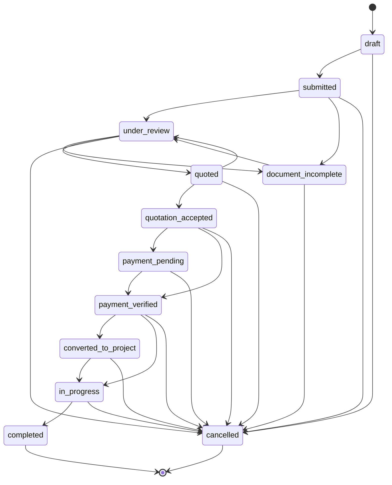

# Permit Application State Machine

Dokumen ini mendefinisikan state machine untuk `PermitApplication.status`, termasuk aturan bisnis dan transisi yang diizinkan. Semua perubahan status wajib melalui [PermitApplicationWorkflowService.php](file:///home/bizmark/bizmark.id/app/Services/PermitApplicationWorkflowService.php).

## Status

- `draft`
- `submitted`
- `under_review`
- `document_incomplete`
- `quoted`
- `quotation_accepted`
- `payment_pending`
- `payment_verified`
- `converted_to_project`
- `in_progress`
- `completed`
- `cancelled`

## Diagram (Mermaid)

## Aturan bisnis per status (ringkas)

- `draft`: dibuat oleh client; bisa diedit; belum dianggap sebagai permohonan resmi.
- `submitted`: permohonan resmi masuk; admin boleh mulai review.
- `under_review`: admin melakukan pemeriksaan data/dokumen.
- `document_incomplete`: admin meminta revisi/kelengkapan dokumen.
- `quoted`: quotation sudah dibuat; menunggu keputusan client.
- `quotation_accepted`: client menerima quotation; dapat lanjut ke payment (manual/gateway).
- `payment_pending`: client mengunggah bukti manual / menunggu settlement gateway.
- `payment_verified`: pembayaran terverifikasi (manual/gateway success).
- `converted_to_project`: aplikasi sudah dibuatkan `Project` dan terhubung ke `project_id`.
- `in_progress`: tim menjalankan pekerjaan.
- `completed`: layanan selesai.
- `cancelled`: permohonan dibatalkan (oleh client/admin/system sesuai aturan).

