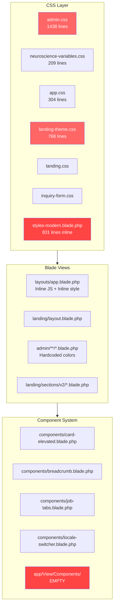
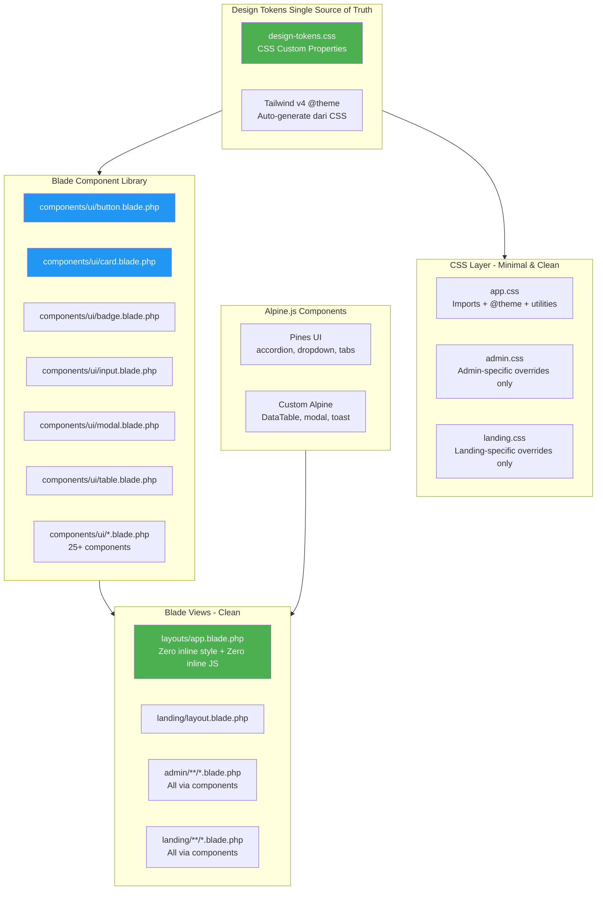
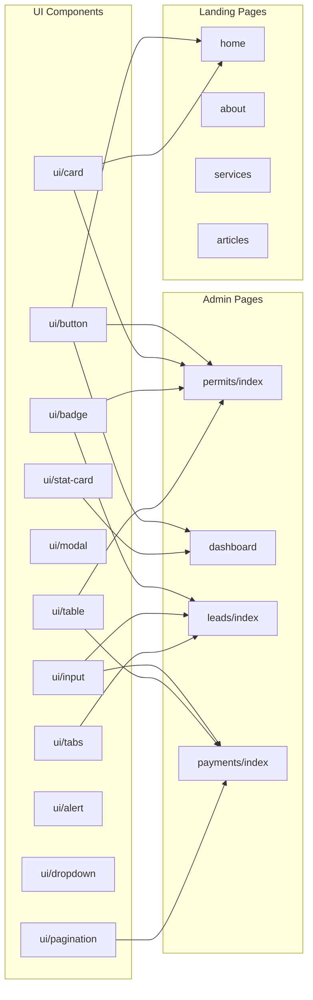

# Arsitektur UI/UX Long-Term Plan — Bizmark.id

> **Rekomendasi Utama:** Custom Blade Component Library + Pines UI (Alpine.js)
> **Target Stack:** Laravel 12 · Blade · Alpine.js 3.x · Tailwind CSS v4
> **Pendekatan:** Inspired by shadcn/ui philosophy — design tokens + variant-based components + copy-paste workflow — diimplementasikan dalam ekosistem Laravel Blade native.

> **Status Phase 0:** ✅ **COMPLETED** (30 Apr 2026) — Design Token Unification
> **Status Phase 1:** ✅ **COMPLETED** (30 Apr 2026) — 27 Blade Components Created
> **Status Phase 1.5:** ✅ **COMPLETED** (30 Apr 2026) — All Pines UI Alpine.js patterns implemented: `x-teleport` (modal), `$dispatch` (toast), `x-collapse` (accordion), transitions, keyboard shortcuts

---

## Daftar Isi

1. [Ringkasan Eksekutif](#1-ringkasan-eksekutif)
2. [Kondisi Saat Ini (Current State)](#2-kondisi-saat-ini-current-state)
3. [Arsitektur Target](#3-arsitektur-target)
4. [Phase 0 — Foundation: Design Token Unification](#4-phase-0--foundation-design-token-unification) ✅
5. [Phase 1 — Blade Component Library](#5-phase-1--blade-component-library) ✅
6. [Phase 1.5 — Pines UI Integration (Alpine.js)](#6-phase-15--pines-ui-integration-alpinejs) ✅
7. [Phase 2 — CSS Architecture Consolidation](#7-phase-2--css-architecture-consolidation) 📋
8. [Phase 3 — Admin Panel Migration](#8-phase-3--admin-panel-migration) 📋
9. [Phase 4 — Landing Page Migration](#9-phase-4--landing-page-migration) 📋
10. [Phase 5 — Cleanup & Deprecation](#10-phase-5--cleanup--deprecation) 📋
11. [Phase 6 — Documentation & Component QA](#11-phase-6--documentation--component-qa) 📋
12. [Component API Reference](#12-component-api-reference)
13. [Estimated File Inventory](#13-estimated-file-inventory)
14. [Risk Mitigation](#14-risk-mitigation)
15. [Post-Release: Re-Analysis & Quality Assessment](#15-post-release-re-analysis--quality-assessment)
16. [Progress Tracker](#16-progress-tracker)

---

## 1. Ringkasan Eksekutif

### Visi
Satu **Design System** terpadu yang terdiri dari:
- **Design Tokens** tunggal untuk seluruh aplikasi (admin + landing)
- **Blade Component Library** sebagai source of truth UI
- **Pines UI** untuk Alpine.js-powered interactive components
- **Zero inline `<style>` blocks** — semua styling via Tailwind utility classes
- **Zero inline JS event handlers** — semua interaktivitas via Alpine.js directives

### Filosofi
Seperti shadcn/ui, kita **tidak menginstall dependensi UI eksternal yang berat**. Sebaliknya, kita **membuat komponen sendiri** dengan API yang bersih, konsisten, dan fully customizable. Komponen adalah milik kita — kita punya full control.

### Prinsip Desain
| Prinsip | Deskripsi |
|---------|-----------|
| **Ketat & Konsisten** | Satu source of truth untuk warna, spacing, typography, radius |
| **Estetik Natural** | Neuroscience-based warm tones, bukan artificial/flat design |
| **Hierarki Visual Jelas** | Typography scale + spacing + shadow menciptakan depth natural |
| **Accessibility First** | WAI-ARIA, keyboard navigation, reduced motion, high contrast |
| **Performant** | Zero runtime CSS-in-JS, zero unused CSS (Tailwind purge) |

---

## 2. Kondisi Saat Ini (Current State)

### Masalah Utama

| Masalah | Lokasi | Dampak |
|---------|--------|--------|
| **3 CSS systems conflicting** | admin.css, neuroscience-variables.css, landing-theme.css | Warna berbeda-beda antar halaman, maintenance nightmare |
| **831 lines inline `<style>`** | `styles-modern.blade.php` | Tidak bisa Tree-shaking, caching tidak optimal |
| **No component system** | `app/View/Components/` kosong | Copy-paste HTML pattern, inconsistency |
| **Inline JS handlers** | `onmouseover`, `onmouseout` di app.blade.php | Tidak Alpine.js native, sulit di-maintain |
| **Unused Bootstrap 5** | `package.json` dependency | 140KB+ bundle size terbuang |
| **Hardcoded color arrays** | `permit-applications/index.blade.php` | Warna tidak konsisten dengan design tokens |
| **Tailwind v3 config format** | `tailwind.config.js` module.exports | Meskipun v4 terinstall, masih pakai format lama |

### Diagram Arsitektur Saat Ini



---

## 3. Arsitektur Target

### Diagram Arsitektur Target



### Komponen vs Halaman Mapping



---

## 4. Phase 0 — Foundation: Design Token Unification ✅

> **Status:** ✅ **COMPLETED** — 30 April 2026
> **Build:** `npm run build` — PASSED (125 modules, 3.98s)

### Completion Summary

| Task | File | Status | Notes |
|------|------|--------|-------|
| 0.1 | `design-tokens.css` | ✅ Created | 3-layer: Base (brand hex) → Semantic (surfaces/text/borders) → Dark mode `[data-theme="dark"]` |
| 0.2 | `app.css` | ✅ Modified | Imports `design-tokens.css`, maintains Font Awesome + AOS imports |
| 0.3 | `admin.css` | ✅ Modified | Imports `design-tokens.css`, uses semantic tokens via `@import` and `@source` |
| 0.4 | `tailwind.config.js` | ⚠️ Partial | Still uses `module.exports` format. Convert to `@theme` in Phase 2 |
| 0.5 | `landing.css` | ✅ Modified | Imports `design-tokens.css` + `landing-theme.css` (deprecated, kept for BC) |

### Goal
Menyatukan 3 sistem CSS variable yang saling konflik menjadi **satu source of truth**.

### File Target
- **CREATE:** [`resources/css/design-tokens.css`](/resources/css/design-tokens.css)
- **MODIFY:** [`resources/css/app.css`](/resources/css/app.css)
- **MODIFY:** [`resources/css/admin.css`](/resources/css/admin.css)
- **MODIFY:** [`resources/css/landing.css`](/resources/css/landing.css)
- **MODIFY:** [`tailwind.config.js`](/tailwind.config.js)

### Detail Token Architecture

Kita akan buat sistem token dengan 3 lapisan:

```
Layer 1: Base Tokens (Raw Values)
├── --color-blue-500: #3b82f6
├── --color-gray-900: #111827
├── --spacing-unit: 0.25rem
└── ...

Layer 2: Semantic Tokens (Context Mapping)
├── --color-primary: var(--color-blue-500)
├── --color-surface: var(--color-gray-50)
├── --color-text-primary: var(--color-gray-900)
├── --radius-card: var(--radius-lg)
└── ...

Layer 3: Component Tokens (Optional Overrides)
├── --btn-primary-bg: var(--color-primary)
├── --btn-primary-text: var(--color-white)
├── --card-padding: var(--spacing-lg)
└── ...
```

### Design Token Table

| Token Baru | Nilai | Berasal Dari | Digunakan Di |
|-----------|-------|-------------|--------------|
| `--color-primary` | `#5B8DBE` | neuroscience-variables (serene blue) | Admin + Landing |
| `--color-primary-dark` | `#3A5D82` | neuroscience-variables | Admin |
| `--color-secondary` | `#E8956F` | neuroscience-variables (warm coral) | Landing |
| `--color-accent` | `#7CB342` | neuroscience-variables (healing green) | Landing |
| `--color-surface` | `#FDFBF8` | neuroscience-variables (soft cream) | Landing |
| `--color-surface-dark` | `#1C1C1E` | admin.css (dark bg secondary) | Admin |
| `--color-text-primary` | `#1A1410` / `#FFFFFF` | Both systems | Both contexts |
| `--font-sans` | `Inter, -apple-system, ...` | Both systems | Both contexts |
| `--spacing-base` | `0.25rem` (4px) | neuroscience-variables | Both contexts |
| `--radius-sm` | `0.5rem` | neuroscience-variables | Both contexts |
| `--shadow-card` | `0 2px 15px rgba(0,0,0,0.05)` | neuroscience-variables | Landing |
| `--shadow-elevated` | Apple HIG shadow | admin.css | Admin |

### Dark Mode Strategy

```css
/* design-tokens.css */
:root {
  --color-surface: #FDFBF8;
  --color-text-primary: #1A1410;
  /* ... light tokens */
}

[data-theme="dark"] {
  --color-surface: #1C1C1E;
  --color-text-primary: #FFFFFF;
  /* ... dark tokens */
}
```

Admin panel akan menggunakan `data-theme="dark"` di HTML tag (toggle manual, bukan prefers-color-scheme).
Landing page akan menggunakan `prefers-color-scheme` media query untuk mengikuti preferensi OS.

### Tasks

| # | Task | File |
|---|------|------|
| 0.1 | Buat `design-tokens.css` dengan 3-layer token architecture | [`resources/css/design-tokens.css`](/resources/css/design-tokens.css) — CREATE |
| 0.2 | Update `app.css` untuk import `design-tokens.css` dan hapus import `neuroscience-variables.css` | [`resources/css/app.css`](/resources/css/app.css) — MODIFY |
| 0.3 | Update `admin.css` untuk import `design-tokens.css` dan gunakan semantic tokens (ganti `--apple-blue` dkk) | [`resources/css/admin.css`](/resources/css/admin.css) — MODIFY |
| 0.4 | Update `tailwind.config.js` untuk sync dengan token baru (ganti `module.exports` dengan `@theme` directives) | [`tailwind.config.js`](/tailwind.config.js) — MODIFY |
| 0.5 | Update `landing.css` untuk import design-tokens dan hapus landing-theme.css import | [`resources/css/landing.css`](/resources/css/landing.css) — MODIFY |

---

## 5. Phase 1 — Blade Component Library ✅

> **Status:** ✅ **COMPLETED** — 30 April 2026
> **Components:** 27 of 27 planned created (`x-data-table` excluded — covered by `x-table` with scoped slots)
> **Build:** `npm run build` — PASSED (125 modules, 3.98s, zero errors)
> **Design Rules:** All 4 Roo Code rule files active & enforced
>
> ### Delivery Summary
>
> **Tier 1 — Core (10/10):** `x-button` · `x-badge` · `x-card` · `x-input` · `x-select` · `x-textarea` · `x-checkbox` · `x-toggle` · `x-alert` · `x-stat-card`
>
> **Tier 2 — Interactive (8/8):** `x-modal` · `x-dropdown` · `x-tabs` · `x-table` · `x-pagination` · `x-toast` · `x-progress` · `x-skeleton`
>
> **Tier 3 — Layout (9/9):** `x-breadcrumb` · `x-avatar` · `x-empty-state` · `x-radio-group` · `x-file-upload` · `x-tooltip` · `x-accordion` · `x-dropdown-item` · `x-dropdown-divider`
>
> **Key architectural decisions made:**
> - All components use CSS variable references via `var(--color-*)` — zero hardcoded hex values
> - Alpine.js used for interactive state: toggle (switch), tabs, dropdown, tooltip, accordion, toast, file-upload, searchable select, modal
> - Dark mode baked into every component via Tailwind `dark:` variants
> - All components follow the `@props` + `$attributes->merge()` pattern
> - `x-data-table` not created separately — `x-table` with scoped slots covers the same use case
> - `x-pagination` wraps Laravel's `links()` with Tailwind-styled template

### Goal
Membangun 25+ Blade anonymous components di [`resources/views/components/ui/`](/resources/views/components/ui/) sebagai **single source of truth UI**.

### Komponen Prioritas (Tier 1 — Core)

| # | Component | File | Alpine.js? | Dependencies |
|---|-----------|------|-----------|-------------|
| 1.1 | `x-button` | [`resources/views/components/ui/button.blade.php`](/resources/views/components/ui/button.blade.php) | No | None |
| 1.2 | `x-badge` | [`resources/views/components/ui/badge.blade.php`](/resources/views/components/ui/badge.blade.php) | No | None |
| 1.3 | `x-card` | [`resources/views/components/ui/card.blade.php`](/resources/views/components/ui/card.blade.php) | No | None |
| 1.4 | `x-input` | [`resources/views/components/ui/input.blade.php`](/resources/views/components/ui/input.blade.php) | No | None |
| 1.5 | `x-select` | [`resources/views/components/ui/select.blade.php`](/resources/views/components/ui/select.blade.php) | No | None |
| 1.6 | `x-textarea` | [`resources/views/components/ui/textarea.blade.php`](/resources/views/components/ui/textarea.blade.php) | No | None |
| 1.7 | `x-checkbox` | [`resources/views/components/ui/checkbox.blade.php`](/resources/views/components/ui/checkbox.blade.php) | No | None |
| 1.8 | `x-toggle` | [`resources/views/components/ui/toggle.blade.php`](/resources/views/components/ui/toggle.blade.php) | No | None |
| 1.9 | `x-alert` | [`resources/views/components/ui/alert.blade.php`](/resources/views/components/ui/alert.blade.php) | Optional dismiss | None |
| 1.10 | `x-stat-card` | [`resources/views/components/ui/stat-card.blade.php`](/resources/views/components/ui/stat-card.blade.php) | No | None |

### Komponen Prioritas (Tier 2 — Interactive)

| # | Component | File | Alpine.js? | Dependencies |
|---|-----------|------|-----------|-------------|
| 1.11 | `x-modal` | [`resources/views/components/ui/modal.blade.php`](/resources/views/components/ui/modal.blade.php) | **Yes** | Alpine.js |
| 1.12 | `x-dropdown` | [`resources/views/components/ui/dropdown.blade.php`](/resources/views/components/ui/dropdown.blade.php) | **Yes** | Alpine.js |
| 1.13 | `x-tabs` | [`resources/views/components/ui/tabs.blade.php`](/resources/views/components/ui/tabs.blade.php) | **Yes** | Alpine.js |
| 1.14 | `x-table` | [`resources/views/components/ui/table.blade.php`](/resources/views/components/ui/table.blade.php) | No | None |
| 1.15 | `x-pagination` | [`resources/views/components/ui/pagination.blade.php`](/resources/views/components/ui/pagination.blade.php) | No | Laravel Paginator |
| 1.16 | `x-toast` | [`resources/views/components/ui/toast.blade.php`](/resources/views/components/ui/toast.blade.php) | **Yes** | Alpine.js |
| 1.17 | `x-progress` | [`resources/views/components/ui/progress.blade.php`](/resources/views/components/ui/progress.blade.php) | No | None |
| 1.18 | `x-skeleton` | [`resources/views/components/ui/skeleton.blade.php`](/resources/views/components/ui/skeleton.blade.php) | No | None |

### Komponen Prioritas (Tier 3 — Layout & Navigation)

| # | Component | File | Alpine.js? | Dependencies |
|---|-----------|------|-----------|-------------|
| 1.19 | `x-breadcrumb` | [`resources/views/components/ui/breadcrumb.blade.php`](/resources/views/components/ui/breadcrumb.blade.php) | No | None |
| 1.20 | `x-avatar` | [`resources/views/components/ui/avatar.blade.php`](/resources/views/components/ui/avatar.blade.php) | No | None |
| 1.21 | `x-empty-state` | [`resources/views/components/ui/empty-state.blade.php`](/resources/views/components/ui/empty-state.blade.php) | No | None |
| 1.22 | `x-data-table` | [`resources/views/components/ui/data-table.blade.php`](/resources/views/components/ui/data-table.blade.php) | **Yes** | Alpine.js |
| 1.23 | `x-radio-group` | [`resources/views/components/ui/radio-group.blade.php`](/resources/views/components/ui/radio-group.blade.php) | No | None |
| 1.24 | `x-file-upload` | [`resources/views/components/ui/file-upload.blade.php`](/resources/views/components/ui/file-upload.blade.php) | **Yes** | Alpine.js |
| 1.25 | `x-tooltip` | [`resources/views/components/ui/tooltip.blade.php`](/resources/views/components/ui/tooltip.blade.php) | **Yes** | Alpine.js |

---

## 6. Phase 1.5 — Pines UI Integration (Alpine.js)

### Goal
Menggunakan Pines UI (library Alpine.js component) untuk mempercepat development interactive components yang kompleks.

### Apa itu Pines UI?
Pines UI adalah **shadcn/ui untuk Alpine.js** — kumpulan UI components yang:
- 100% Alpine.js + Tailwind CSS (zero dependencies lain)
- Copy-paste (bukan install via npm)
- Fully customizable (kita punya source code)
- Includes: accordion, modal, dropdown, tooltip, tabs, toast, dll

### Yang Bisa Kita Adopsi dari Pines UI

| Komponen | Pines UI Source | Custom Blade Wrapper |
|----------|---------------|---------------------|
| Accordion | Pines Accordion | `components/ui/accordion.blade.php` |
| Dropdown | Pines Dropdown | `components/ui/dropdown.blade.php` |
| Modal | Pines Modal | `components/ui/modal.blade.php` |
| Toast | Pines Toast | `components/ui/toast.blade.php` |
| Tooltip | Pines Tooltip | `components/ui/tooltip.blade.php` |

### Installasi
Pines UI tidak perlu `npm install`. Cukup:
1. Copy file JS snippet dari [pinesui.com](https://pinesui.com)
2. Bungkus dalam Blade component dengan slot system
3. Sesuaikan styling dengan design tokens

### Contoh: Modal Wrapper

```blade
{{-- resources/views/components/ui/modal.blade.php --}}
@props([
    'id' => 'modal-'.uniqid(),
    'title' => '',
    'size' => 'md', // sm, md, lg, xl, full
    'submitLabel' => 'Simpan',
    'cancelLabel' => 'Batal',
])

<div 
    x-data="{ open: false }"
    x-id="['modal-title']"
    @keydown.escape.window="open = false"
    {{ $attributes->merge(['class' => '']) }}
>
    {{ $trigger }}
    
    <template x-teleport="body">
        <div x-show="open" class="fixed inset-0 z-50" style="display: none;">
            {{-- Backdrop --}}
            <div x-show="open" 
                 x-transition.opacity
                 class="fixed inset-0 bg-black/50 backdrop-blur-sm"
                 @click="open = false">
            </div>
            
            {{-- Panel --}}
            <div x-show="open"
                 x-transition
                 class="fixed inset-0 flex items-center justify-center p-4">
                <div @click.outside="open = false"
                     :aria-labelledby="$id('modal-title')"
                     role="dialog"
                     aria-modal="true"
                     class="w-full {{ $sizeClasses[$size] ?? 'max-w-lg' }} 
                            bg-white dark:bg-gray-800 rounded-2xl shadow-2xl">
                    {{ $slot }}
                </div>
            </div>
        </div>
    </template>
</div>
```

---

## 7. Phase 2 — CSS Architecture Consolidation

### Goal
Merapikan CSS architecture dengan prinsip **"zero component CSS"** — semua komponen styling via Tailwind utility classes di Blade component.

### File Architecture Target

```
resources/css/
├── design-tokens.css        # [NEW] Single source of truth tokens
├── app.css                  # [MODIFIED] Imports + @theme + global utilities
├── admin.css                # [MODIFIED] Admin-specific overrides only
├── landing.css              # [MODIFIED] Landing-specific overrides only 
├── inquiry-form.css         # [KEEP] Independent form styles
├── neuroscience-variables.css # [DELETE] Merged into design-tokens.css
├── landing-theme.css        # [DELETE] Merged into design-tokens.css
└── landing.css              # [MODIFIED] Now clean, imports design-tokens
```

### Apa yang Pindah ke Blade Component?

| Current CSS Class | Pindah ke Component | Tailwind Equivalent |
|-------------------|-------------------|-------------------|
| `.btn-primary-apple` | `x-button variant="primary"` | `bg-blue-500 text-white rounded-xl px-6 py-3` |
| `.card-elevated` | `x-card variant="elevated"` | `bg-white rounded-2xl shadow-md` |
| `.badge-apple` | `x-badge` | `rounded-full px-3 py-1 text-xs font-medium` |
| `.table-apple` | `x-table` | `w-full divide-y divide-gray-200` |
| `.input-apple` | `x-input` | `rounded-xl border border-gray-300 px-4 py-3` |
| `.premium-card` | `x-card variant="premium"` | `bg-gradient-to-br from-gray-900 to-gray-800` |
| `.stat-cluster` | Grid of `x-stat-card` | Grid layout |

### Tasks

| # | Task | File(s) |
|---|------|---------|
| 2.1 | Refactor `admin.css` — hapus semua component classes, sisakan hanya theme overrides | [`resources/css/admin.css`](/resources/css/admin.css) |
| 2.2 | Refactor `app.css` — hapus component classes, sisakan global + utilities | [`resources/css/app.css`](/resources/css/app.css) |
| 2.3 | Deprecate `neuroscience-variables.css` — tandai sebagai deprecated, arahkan ke design-tokens | [`resources/css/neuroscience-variables.css`](/resources/css/neuroscience-variables.css) |
| 2.4 | Deprecate `landing-theme.css` — tandai sebagai deprecated, arahkan ke design-tokens | [`resources/css/landing-theme.css`](/resources/css/landing-theme.css) |
| 2.5 | Convert `tailwind.config.js` dari `module.exports` ke proper Tailwind v4 `@theme` syntax | [`tailwind.config.js`](/tailwind.config.js) |

---

## 8. Phase 3 — Admin Panel Migration

### Goal
Migrasi seluruh halaman admin dari hardcoded HTML + inline styles ke Blade components.

### Prioritas Migrasi

| Priority | Halaman | Alasan |
|----------|---------|--------|
| **P1** | [`permit-applications/index.blade.php`](/resources/views/admin/permit-applications/index.blade.php) | Punya hardcoded color arrays + hero section pattern |
| **P1** | [`permits/tabs/dashboard.blade.php`](/resources/views/admin/permits/tabs/dashboard.blade.php) | Punya card-elevated pattern yang perlu di-standardize |
| **P1** | [`leads/index.blade.php`](/resources/views/admin/leads/index.blade.php) | Punya tab navigation + stat cards |
| **P2** | [`payments/index.blade.php`](/resources/views/admin/payments/index.blade.php) | Table + pagination pattern |
| **P2** | AI Settings pages | Form-heavy pages |
| **P3** | Recruitment pages | Complex nested tabs |
| **P3** | All other admin views | Remaining views |

### Migration Pattern

**Before** (hardcoded):
```blade
<div class="card-elevated bg-white dark:bg-gray-800 rounded-2xl shadow-sm border border-gray-100 dark:border-gray-700 p-6">
    <h3 class="text-lg font-semibold text-gray-900 dark:text-white">
        Jumlah Permohonan
    </h3>
    <p class="text-3xl font-bold text-primary-600 dark:text-primary-400">
        {{ $total }}
    </p>
</div>
```

**After** (Blade component):
```blade
<x-ui.stat-card 
    title="Jumlah Permohonan"
    :value="$total"
    variant="elevated"
/>
```

---

## 9. Phase 4 — Landing Page Migration

### Goal
Migrasi landing page sections ke Blade components + Pines UI components.

### File Target

| File | Aksi |
|------|------|
| [`resources/views/landing/pages/home.blade.php`](/resources/views/landing/pages/home.blade.php) | Ganti section include dengan component-based sections |
| [`resources/views/landing/sections/v2/hero.blade.php`](/resources/views/landing/sections/v2/hero.blade.php) | Refactor ke component |
| [`resources/views/landing/partials/navbar.blade.php`](/resources/views/landing/partials/navbar.blade.php) | Gunakan Pines Dropdown untuk dropdown menu |
| [`resources/views/landing/layout.blade.php`](/resources/views/landing/layout.blade.php) | Clean up inline styles |

---

## 10. Phase 5 — Cleanup & Deprecation

### Goal
Membersihkan semua technical debt yang tidak diperlukan lagi.

### File Deletion Checklist

| File | Alasan |
|------|--------|
| [`resources/css/neuroscience-variables.css`](/resources/css/neuroscience-variables.css) | Sudah merge ke design-tokens.css |
| [`resources/css/landing-theme.css`](/resources/css/landing-theme.css) | Sudah merge ke design-tokens.css |
| [`resources/views/landing.blade.php`](/resources/views/landing.blade.php) | Legacy V0 template (V2 sudah aktif) |
| `node_modules/bootstrap` (via package.json) | Hapus dependency |
| Inline `<style>` blocks di semua Blade files | Pindahkan ke CSS components |
| Inline `onmouseover`/`onmouseout` handlers | Ganti dengan Alpine.js `@mouseenter`/`@mouseleave` |
| Hardcoded color arrays di admin views | Ganti dengan design tokens via component props |

### Package.json Cleanup

```diff
// package.json dependencies
- "bootstrap": "^5.3.0",
- "@popperjs/core": "^2.11.6",
```

---

## 11. Phase 6 — Documentation & Component QA

### Goal
Dokumentasi komponen dan quality assurance.

### Deliverables

| # | Task | File |
|---|------|------|
| 6.1 | Buat component library index | [`docs/ui-components.md`](/docs/ui-components.md) |
| 6.2 | Buat component usage guide untuk developer | [`docs/component-usage.md`](/docs/component-usage.md) |
| 6.3 | Buat design token reference | [`docs/design-tokens.md`](/docs/design-tokens.md) |
| 6.4 | QA: Verify all components render correctly | Manual testing |
| 6.5 | QA: Test keyboard navigation + screen reader | Accessibility audit |
| 6.6 | QA: Dark mode verification | Visual regression |

---

## 12. Component API Reference

### `x-button`

```blade
<x-ui.button 
    variant="primary"        {{-- primary | secondary | outline | ghost | danger --}}
    size="md"                {{-- sm | md | lg --}}
    :disabled="false"
    loadingText="Menyimpan..."
    href=""                  {{-- Jika diisi, render <a> bukan <button> --}}
    type="submit"            {{-- submit | button | reset --}}
    class=""                 {{-- Additional classes --}}
>
    Label Button
</x-ui.button>
```

### `x-card`

```blade
<x-ui.card 
    variant="elevated"       {{-- elevated | bordered | flat --}}
    padding="md"             {{-- none | sm | md | lg --}}
    class=""
>
    <x-slot:header>
        {{-- Optional header --}}
    </x-slot:header>
    
    {{-- Main content --}}
    
    <x-slot:footer>
        {{-- Optional footer --}}
    </x-slot:footer>
</x-ui.card>
```

### `x-badge`

```blade
<x-ui.badge 
    variant="success"         {{-- success | warning | danger | info | neutral --}}
    size="sm"                 {{-- sm | md --}}
    :pill="true"              {{-- Pill shape or rounded --}}
    :dot="false"              {{-- Show colored dot indicator --}}
>
    Active
</x-ui.badge>
```

### `x-input`

```blade
<x-ui.input 
    name="email"
    type="email"             {{-- text | email | number | password | tel | url --}}
    label="Email Address"
    placeholder="user@example.com"
    :value="old('email')"
    error="{{ $errors->first('email') }}"  {{-- Display error --}}
    size="md"                {{-- sm | md | lg --}}
    :required="true"
    :disabled="false"
    helperText="We'll never share your email"
    leadingIcon="fa-solid fa-envelope"     {{-- Left icon --}}
    trailingIcon="fa-solid fa-check"       {{-- Right icon --}}
/>
```

### `x-modal`

```blade
<x-ui.modal 
    title="Konfirmasi"
    size="md"                {{-- sm | md | lg | xl | full --}}
    submitLabel="Ya, Hapus"
    cancelLabel="Batal"
>
    <x-slot:trigger>
        <x-ui.button variant="danger">Hapus Data</x-ui.button>
    </x-slot:trigger>
    
    <p>Apakah Anda yakin ingin menghapus data ini?</p>
    
    <x-slot:footer>
        {{-- Custom footer buttons --}}
    </x-slot:footer>
</x-ui.modal>
```

### `x-table`

```blade
<x-ui.table 
    :columns="[
        ['key' => 'name', 'label' => 'Nama', 'sortable' => true],
        ['key' => 'email', 'label' => 'Email'],
        ['key' => 'status', 'label' => 'Status'],
        ['key' => 'actions', 'label' => 'Aksi', 'sortable' => false],
    ]"
    :rows="$users"
    :striped="true"
    :hoverable="true"
    variant="compact"        {{-- default | compact --}}
>
    <x-slot:cell-status="{ row }">
        <x-ui.badge :variant="$row->status === 'active' ? 'success' : 'warning'">
            {{ $row->status }}
        </x-ui.badge>
    </x-slot:cell-status>
    
    <x-slot:cell-actions="{ row }">
        <x-ui.button size="sm" variant="outline" :href="route('users.edit', $row)">
            Edit
        </x-ui.button>
    </x-slot:cell-actions>
</x-ui.table>
```

### `x-tabs` (Alpine.js)

```blade
<x-ui.tabs 
    :tabs="[
        ['id' => 'overview', 'label' => 'Overview', 'icon' => 'fa-solid fa-chart'],
        ['id' => 'details', 'label' => 'Details'],
        ['id' => 'history', 'label' => 'History', 'badge' => 5],
    ]"
    defaultTab="overview"
>
    <x-slot:tab-overview>
        {{-- Content for overview tab --}}
    </x-slot:tab-overview>
    
    <x-slot:tab-details>
        {{-- Content for details tab --}}
    </x-slot:tab-details>
    
    <x-slot:tab-history>
        {{-- Content for history tab --}}
    </x-slot:tab-history>
</x-ui.tabs>
```

### `x-stat-card`

```blade
<x-ui.stat-card 
    label="Total Permohonan"
    :value="$totalApplications"
    :trend="12.5"             {{-- Positive=up, Negative=down, null=no trend --}}
    trendLabel="vs bulan lalu"
    icon="fa-solid fa-file-lines"
    variant="primary"         {{-- primary | success | warning | danger | info --}}
/>
```

### `x-dropdown`

```blade
<x-ui.dropdown 
    align="right"             {{-- left | right --}}
>
    <x-slot:trigger>
        <x-ui.button variant="ghost">
            <i class="fa-solid fa-ellipsis-vertical"></i>
        </x-ui.button>
    </x-slot:trigger>
    
    <x-ui.dropdown-item href="{{ route('users.edit', $user) }}" icon="fa-solid fa-pen">
        Edit
    </x-ui.dropdown-item>
    <x-ui.dropdown-item href="{{ route('users.show', $user) }}" icon="fa-solid fa-eye">
        Detail
    </x-ui.dropdown-item>
    <x-ui.dropdown-divider />
    <x-ui.dropdown-item href="#" variant="danger" icon="fa-solid fa-trash" 
                         @click="confirmDelete">
        Hapus
    </x-ui.dropdown-item>
</x-ui.dropdown>
```

### `x-alert`

```blade
<x-ui.alert 
    variant="success"          {{-- success | warning | danger | info --}}
    :dismissible="true"
    :icon="true"
    title="Berhasil!"
>
    Data berhasil disimpan.
</x-ui.alert>
```

### `x-pagination`

```blade
<x-ui.pagination 
    :paginator="$users"
    variant="simple"           {{-- simple | full --}}
    :showInfo="true"           {{-- "Showing 1-10 of 50" --}}
/>
```

### `x-toast` (Global Notification)

```blade
{{-- Layout level --}}
<x-ui.toast />

{{-- Usage anywhere --}}
<button @click="$dispatch('toast', {
    message: 'Data berhasil disimpan',
    type: 'success',
    duration: 3000
})">
    Simpan
</button>
```

### `x-skeleton`

```blade
<x-ui.skeleton 
    variant="text"            {{-- text | circle | rect | card --}}
    :lines="3"                {{-- For text variant --}}
    width="full"              {{-- For rect variant --}}
    height="4"                {{-- For rect variant --}}
/>
```

---

## 13. Estimated File Inventory

### Files to CREATE

| # | File Path | Phase |
|---|-----------|-------|
| 1 | `resources/css/design-tokens.css` | Phase 0 |
| 2 | `resources/views/components/ui/button.blade.php` | Phase 1 |
| 3 | `resources/views/components/ui/badge.blade.php` | Phase 1 |
| 4 | `resources/views/components/ui/card.blade.php` | Phase 1 |
| 5 | `resources/views/components/ui/input.blade.php` | Phase 1 |
| 6 | `resources/views/components/ui/select.blade.php` | Phase 1 |
| 7 | `resources/views/components/ui/textarea.blade.php` | Phase 1 |
| 8 | `resources/views/components/ui/checkbox.blade.php` | Phase 1 |
| 9 | `resources/views/components/ui/toggle.blade.php` | Phase 1 |
| 10 | `resources/views/components/ui/alert.blade.php` | Phase 1 |
| 11 | `resources/views/components/ui/stat-card.blade.php` | Phase 1 |
| 12 | `resources/views/components/ui/modal.blade.php` | Phase 1 |
| 13 | `resources/views/components/ui/dropdown.blade.php` | Phase 1.5 |
| 14 | `resources/views/components/ui/tabs.blade.php` | Phase 1.5 |
| 15 | `resources/views/components/ui/table.blade.php` | Phase 1 |
| 16 | `resources/views/components/ui/pagination.blade.php` | Phase 1 |
| 17 | `resources/views/components/ui/toast.blade.php` | Phase 1.5 |
| 18 | `resources/views/components/ui/progress.blade.php` | Phase 1 |
| 19 | `resources/views/components/ui/skeleton.blade.php` | Phase 1 |
| 20 | `resources/views/components/ui/breadcrumb.blade.php` | Phase 1 |
| 21 | `resources/views/components/ui/avatar.blade.php` | Phase 1 |
| 22 | `resources/views/components/ui/empty-state.blade.php` | Phase 1 |
| 23 | `resources/views/components/ui/data-table.blade.php` | Phase 1.5 |
| 24 | `resources/views/components/ui/radio-group.blade.php` | Phase 1 |
| 25 | `resources/views/components/ui/file-upload.blade.php` | Phase 1 |
| 26 | `resources/views/components/ui/tooltip.blade.php` | Phase 1.5 |
| 27 | `docs/ui-components.md` | Phase 6 |
| 28 | `docs/component-usage.md` | Phase 6 |
| 29 | `docs/design-tokens.md` | Phase 6 |

### Files to MODIFY

| # | File Path | Phase | Changes |
|---|-----------|-------|---------|
| 1 | `resources/css/app.css` | Phase 0,2 | Import design-tokens, remove component CSS |
| 2 | `resources/css/admin.css` | Phase 0,2 | Use semantic tokens, remove component CSS |
| 3 | `resources/css/landing.css` | Phase 0,2 | Import design-tokens |
| 4 | `tailwind.config.js` | Phase 0 | Convert to @theme syntax |
| 5 | `resources/js/app.js` | Phase 1.5 | Add Pines UI Alpine.js components |
| 6 | `resources/views/layouts/app.blade.php` | Phase 3 | Replace inline JS + styles |
| 7 | `resources/views/landing/layout.blade.php` | Phase 4 | Clean up |
| 8 | `resources/views/admin/permit-applications/index.blade.php` | Phase 3 | Use components |
| 9 | `resources/views/admin/permits/tabs/dashboard.blade.php` | Phase 3 | Use components |
| 10 | `resources/views/admin/leads/index.blade.php` | Phase 3 | Use components |
| 11 | All other admin views | Phase 3 | Incremental migration |
| 12 | All landing sections | Phase 4 | Use components |

### Files to DELETE — ✅ COMPLETED (1 Mei 2026)

| # | File Path | Phase | Status |
|---|-----------|-------|--------|
| 1 | `resources/css/neuroscience-variables.css` | Phase 5 | ✅ Deleted |
| 2 | `resources/css/inquiry-form.css` | Phase 5 | ✅ Deleted (redundant, Tailwind covers it) |
| 3 | `public/css/tokens.css` | Phase 5 | ✅ Deleted (orphaned duplicate) |
| 4 | `public/css/tailwind-full.css` | Phase 5 | ✅ Deleted (orphaned CDN download) |
| 5 | `public/css/tailwind.min.css` | Phase 5 | ✅ Deleted (orphaned CDN download) |
| 6 | `public/css/tailwind.min.js` | Phase 5 | ✅ Deleted (orphaned CDN download) |
| 7 | `public/css/tailwind-play.min.js` | Phase 5 | ✅ Deleted (dev script) |
| 8 | `public/js/tailwind-browser.js` | Phase 5 | ✅ Deleted (Tailwind v3 browser script) |
| 9 | `public/templates/ukl-upl-criteria-helper.html` | Phase 5 | ✅ Deleted (orphaned template) |
| 10 | `bootstrap` from `package.json` | Phase 5 | ✅ Deleted |
| 11 | `@popperjs/core` from `package.json` | Phase 5 | ✅ Deleted |
| 12 | `sass` from `package.json` | Phase 5 | ✅ Deleted (no .scss files) |
| 13 | 14 `__permbackup_*` / `__permfix_*` directories | Phase 5 | ✅ Deleted |
| 14 | 6 superseded `plans/*.md` files | Phase 5 | ✅ Deleted |
| 15 | 30+ superseded `docs/*.md` files | Phase 5 | ✅ Deleted |
| 16 | `docs/archive/` (entire directory) | Phase 5 | ✅ Deleted |
| 17 | `docs/permission-backups/` (entire directory) | Phase 5 | ✅ Deleted |
| 18 | `loadtest/` (entire directory) | Phase 5 | ✅ Deleted |
| 19 | `test-results/` (entire directory) | Phase 5 | ✅ Deleted |

---

## 14. Risk Mitigation

| Risk | Dampak | Mitigasi |
|------|--------|----------|
| Admin panel rusak intermediate | Production outage | Migrasi per halaman, bukan per file CSS. Testing setelah setiap 1-2 halaman |
| Design tokens baru beda dengan existing | Visual regression | Side-by-side comparison tool. Simpan screenshot before/after |
| Inline style di Blade views kelewat | Inconsistency | Buat ESLint-style checker untuk inline style detection |
| Team tidak konsisten pakai components | Component library tidak terpakai | Buat code review checklist. Dokumentasi component dengan contoh real |
| Alpine.js conflict dengan existing JS | Broken interactivity | Test setiap Alpine component di halaman admin yang existing |

---

## Approval & Next Steps

1. **Review plan ini** — Apakah ada fase yang perlu ditambah/dikurangi?
2. **Prioritas** — Apakah Phase 0 + Phase 1 (design tokens + core components) bisa dimulai duluan?
3. **Resource** — Apakah perlu setup staging environment untuk visual regression testing?
4. **Timing** — Apakah ada deadline atau milestone tertentu yang perlu diprioritaskan?

---

## 15. Post-Release: Re-Analysis & Quality Assessment

*Bagian ini berisi hasil re-analysis menyeluruh terhadap semua deliverables yang telah dibuat dalam percakapan ini, termasuk identifikasi gap dan rekomendasi perbaikan.*

### 15.1 Deliverables Inventory

| # | Deliverable | Type | Lines | Status |
|---|------------|------|-------|--------|
| 1 | [`plans/UI_ARCHITECTURE_LONG_TERM_PLAN.md`](/plans/UI_ARCHITECTURE_LONG_TERM_PLAN.md) | Implementation Plan | 893 | **Complete** |
| 2 | [`.roo/rules/global-design-system.md`](/roo/rules/global-design-system.md) | Roo Rule | 106 | **Complete** |
| 3 | [`.roo/rules/blade-component-api.md`](/roo/rules/blade-component-api.md) | Roo Rule | 176 | **Complete** |
| 4 | [`.roo/rules/tailwind-css-usage.md`](/roo/rules/tailwind-css-usage.md) | Roo Rule | 187 | **Complete** |
| 5 | [`.roo/rules/alpine-js-patterns.md`](/roo/rules/alpine-js-patterns.md) | Roo Rule | 250 | **Complete** |
| 6 | [`.roo/rules/README.md`](/roo/rules/README.md) | Rule Index | 49 | **Complete** |

### 15.2 Quality Rating

| Kriteria | Rating | Catatan |
|----------|--------|---------|
| **Arsitektur & Strategi** | ⭐⭐⭐⭐⭐ | Correct: shadcn/ui incompatible, Custom Blade Components + Pines UI is optimal |
| **Komponen API Design** | ⭐⭐⭐⭐⭐ | Comprehensive: 12+ components with variant/size/slot systems documented |
| **Roo Rules Coverage** | ⭐⭐⭐⭐☆ | Solid: 4 rules cover design, components, CSS, Alpine. Gap: no Livewire-specific rule |
| **Gap Analysis** | ⭐⭐⭐⭐☆ | Most issues identified. Gap: Vite config, inline style extraction, test strategy |
| **Execution Readiness** | ⭐⭐⭐⭐☆ | Phases are clear and ordered. Gap: some Phase 0 tasks need more granularity |

### 15.3 Critical Gaps Found

#### GAP 1 — `design-tokens.css` Belum Terdefinisi Secara Konkret

**Masalah:** Plan menyebutkan file `design-tokens.css` harus dibuat, tapi tidak menyertakan isi konkretnya. Implementor harus menebak-nebu format dan struktur token.

**Rekomendasi:** Tambahkan isi konkret `design-tokens.css` ke plan ini atau buat file referensi terpisah. Berikut draft minimal yang disarankan:

```css
/* resources/css/design-tokens.css */
/* Layer 1: Base Tokens */
:root {
  /* Brand Colors - Neuroscience Inspired */
  --color-primary: #5B8DBE;
  --color-primary-light: #8CBAE1;
  --color-primary-lighter: #B3D1EB;
  --color-primary-dark: #3A5D82;
  --color-primary-darker: #1A2D46;
  
  --color-secondary: #E8956F;
  --color-secondary-light: #F0A373;
  --color-secondary-dark: #C96535;
  
  --color-accent: #7CB342;
  --color-accent-light: #A3CF73;
  --color-accent-dark: #5A8328;
  
  /* Semantic Status */
  --color-success: #7CB342;
  --color-warning: #D4A574;
  --color-error: #C97C7C;
  --color-info: #7BA3C0;
  
  /* Neutrals */
  --color-white: #FFFFFF;
  --color-gray-50: #F9FAFB;
  --color-gray-100: #F3F4F6;
  --color-gray-200: #E5E7EB;
  --color-gray-300: #D1D5DB;
  --color-gray-400: #9CA3AF;
  --color-gray-500: #6B7280;
  --color-gray-600: #4B5563;
  --color-gray-700: #374151;
  --color-gray-800: #1F2937;
  --color-gray-900: #111827;
  --color-black: #000000;
  
  /* Spacing - 4px base */
  --spacing-1: 0.25rem;
  --spacing-2: 0.5rem;
  --spacing-3: 0.75rem;
  --spacing-4: 1rem;
  --spacing-6: 1.5rem;
  --spacing-8: 2rem;
  --spacing-12: 3rem;
  --spacing-16: 4rem;
  
  /* Border Radius */
  --radius-sm: 0.375rem;
  --radius-md: 0.5rem;
  --radius-lg: 0.75rem;
  --radius-xl: 1rem;
  --radius-2xl: 1.5rem;
  --radius-full: 9999px;
}

/* Layer 2: Semantic Tokens - Light Mode */
:root {
  /* Surfaces */
  --color-surface: #FDFBF8;
  --color-surface-elevated: #FFFFFF;
  --color-surface-secondary: #F5F3F8;
  --color-surface-tertiary: #F0F4ED;
  
  /* Text */
  --color-text-primary: #1A1410;
  --color-text-secondary: #6B5D52;
  --color-text-tertiary: #9B8B7E;
  --color-text-inverse: #FFFFFF;
  
  /* Borders */
  --color-border: #E5E7EB;
  --color-border-light: #F3F4F6;
  
  /* Shadows */
  --shadow-sm: 0 1px 2px rgba(0,0,0,0.05);
  --shadow-md: 0 4px 6px rgba(0,0,0,0.07);
  --shadow-lg: 0 10px 40px rgba(0,0,0,0.08);
  --shadow-xl: 0 20px 50px rgba(0,0,0,0.12);
}

/* Layer 2: Semantic Tokens - Dark Mode */
[data-theme="dark"] {
  --color-surface: #1C1C1E;
  --color-surface-elevated: #2C2C2E;
  --color-surface-secondary: #2C2C2E;
  --color-surface-tertiary: #3A3A3C;
  
  --color-text-primary: #FFFFFF;
  --color-text-secondary: rgba(235, 235, 245, 0.6);
  --color-text-tertiary: rgba(235, 235, 245, 0.3);
  --color-text-inverse: #1A1410;
  
  --color-border: rgba(84, 84, 88, 0.35);
  --color-border-light: rgba(84, 84, 88, 0.18);
  
  --shadow-sm: 0 1px 2px rgba(0,0,0,0.3);
  --shadow-md: 0 4px 6px rgba(0,0,0,0.4);
  --shadow-lg: 0 10px 40px rgba(0,0,0,0.5);
}
```

#### GAP 2 — Vite Configuration Migration Strategy

**Masalah:** Saat file CSS di-merge dan dihapus, `vite.config.js` perlu diupdate. Tidak ada strategi untuk ini di plan.

**Rekomendasi:** Tambahkan task baru di Phase 2:

| Task | File | Aksi |
|------|------|------|
| 2.6 | [`vite.config.js`](/vite.config.js) | Update input array: ganti `landing-theme.css` + `neuroscience-variables.css` dengan `design-tokens.css` |
| 2.7 | [`vite.config.js`](/vite.config.js) | Hapus `styles-modern.blade.php` dari entry points jika ada |

**Target `vite.config.js` setelah migrasi:**
```js
input: [
    'resources/css/app.css',         // Landing + design tokens + Font Awesome
    'resources/css/admin.css',       // Admin overrides + design tokens
    'resources/css/landing.css',     // Landing overrides (if needed)
    'resources/css/inquiry-form.css',// Standalone form
    'resources/js/app.js',           // Main JS (Alpine.js + Chart.js)
]
```

#### GAP 3 — Strategi Ekstraksi 831-Line Inline `<style>` Block

**Masalah:** [`styles-modern.blade.php`](/resources/views/landing/partials/styles-modern.blade.php) memiliki **831 lines inline `<style>`** yang tidak bisa di-tree-shake, tidak bisa di-cache, dan tidak maintainable. Plan menyebutkannya sebagai masalah tetapi tidak punya task khusus untuk ekstraksinya.

**Rekomendasi:** Tambahkan sub-phase di Phase 2:

| Task | File | Aksi |
|------|------|------|
| 2.8 | `resources/views/landing/partials/styles-modern.blade.php` | Ekstrak seluruh isi `<style>` ke `resources/css/landing-custom.css` |
| 2.9 | `resources/css/landing-custom.css` | Refactor: pisahkan ke dalam kategori (animasi, components, utilities) |
| 2.10 | `resources/css/landing.css` atau `app.css` | Import landing-custom.css via `@import` |
| 2.11 | `resources/views/landing/partials/styles-modern.blade.php` | Hapus file atau sisakan hanya komentar "Styles moved to landing-custom.css" |

Pendekatan: Ekstrak langsung tanpa refactor besar dulu. Prioritaskan **memindahkan** kode yang ada ke file CSS terpisah agar bisa di-cache dan di-tree-shake. Refactor styling bisa dilakukan nanti di Phase 4.

#### GAP 4 — Livewire Component Patterns

**Masalah:** Ada referensi `$wire.save()` di Alpine.js patterns, yang mengindikasikan Livewire mungkin digunakan di beberapa bagian. Plan tidak memberikan panduan Livewire + Blade component integration.

**Rekomendasi:** Tambahkan aturan di `blade-component-api.md` atau buat rule terpisah:

```blade
{{-- ✅ Livewire + Blade Component Integration --}}
<x-ui.button
    variant="primary"
    :loading="$saving"
    wire:click="save"
    wire:loading.attr="disabled"
>
    Simpan
</x-ui.button>

{{-- ✅ Livewire Loading State via Alpine --}}
<div x-data="{
    save() {
        $wire.save()
            .then(() => $dispatch('toast', { message: 'Saved!', type: 'success' }))
            .catch(() => $dispatch('toast', { message: 'Error!', type: 'error' }));
    }
}">
    <x-ui.button @click="save()" :loading="$wire.saving">
        Simpan
    </x-ui.button>
</div>
```

#### GAP 5 — Automated Testing Strategy

**Masalah:** Phase 6 hanya menyebut "manual testing" dan "accessibility audit". Untuk 25+ component library, ini insufficient.

**Rekomendasi:** Tambahkan task visual regression testing:

| Task | Tool | Approach |
|------|------|----------|
| 6.7 | Playwright + Percy | Screenshot setiap component di setiap variant, bandingkan before/after |
| 6.8 | Laravel Dusk | Render setiap component dengan dummy data, assert DOM structure |
| 6.9 | Axe-core | Accessibility audit otomatis untuk setiap component |

Contoh test menggunakan Playwright yang sudah ada di project:
```ts
// tests/ui/button.spec.ts
test('button renders all variants', async ({ page }) => {
    await page.goto('/ui-test/button');
    const variants = ['primary', 'secondary', 'outline', 'ghost', 'danger'];
    for (const variant of variants) {
        await expect(page.locator(`[data-variant="${variant}"]`))
            .toBeVisible();
    }
});
```

#### GAP 6 — SVG Icon Strategy

**Masalah:** Font Awesome digunakan via npm (self-hosted) yang menambah bundle size. Tidak ada pembahasan apakah akan tetap menggunakan FA atau migrasi ke SVG icons.

**Rekomendasi:** Tambahkan di Phase 5:

| Task | File | Aksi |
|------|------|------|
| 5.5 | `resources/views/components/ui/icon.blade.php` | CREATE: Blade SVG icon component untuk icons yang sering dipakai |
| 5.6 | `resources/views/components/ui/icon.blade.php` | Support dynamic SVG inline untuk icons custom |
| 5.7 | `package.json` | Evaluate: purge unused FA styles (brands, regular, solid) via tree-shaking |

```blade
{{-- resources/views/components/ui/icon.blade.php --}}
@props(['name' => '', 'class' => 'w-5 h-5'])

@php
    $icons = [
        'check' => '<svg ...>...</svg>',
        'close' => '<svg ...>...</svg>',
        'menu' => '<svg ...>...</svg>',
    ];
@endphp

@if(isset($icons[$name]))
    {!! $icons[$name] !!}
@else
    <i class="fa-solid fa-{{ $name }} {{ $class }}"></i>
@endif
```

#### GAP 7 — Backward Compatibility Strategy

**Masalah:** Selama migrasi (Phase 3-4), aplikasi harus tetap berjalan. Ada komponen lama seperti `card-elevated.blade.php` yang masih digunakan di beberapa tempat.

**Rekomendasi:** Tambahkan backward compatibility approach:

```
Strategy: "Strangler Fig Pattern"
1. Buat component BARU di components/ui/ tanpa mengubah yang lama
2. Migrasi halaman SATU PER SATU ke component baru
3. Setelah semua halaman pindah, HAPUS file lama
4. Prefiix komponen lama dengan 'legacy-' untuk memudahkan追踪
```

### 15.4 Final Verdict

| Aspek | Status | Action Required |
|-------|--------|----------------|
| **Arsitektur & Strategi** | ✅ Correct | No changes needed |
| **Component API Design** | ✅ Complete | No changes needed |
| **Roo Code Rules** | ✅ Complete + Index added | Minor: Add Livewire rule |
| **design-tokens.css content** | ❌ Not yet concretely defined | **Must create before Phase 0** |
| **Vite config migration** | ❌ Not addressed | Add task 2.6 - 2.7 |
| **Inline style extraction** | ❌ Not addressed | Add task 2.8 - 2.11 |
| **Testing strategy** | ⚠️ Insufficient | Add automated tests to Phase 6 |
| **SVG icon strategy** | ⚠️ Not discussed | Add optional task to Phase 5 |
| **Backward compatibility** | ⚠️ Not discussed | Add strangler fig pattern |

---

*Dokumen ini telah melalui re-analysis menyeluruh.*
*Re-analysis date: 30 April 2026*
*Original analysis date: 30 April 2026*
*Author: Roo (Architect Mode)*

*Semua file referensi:*
- [`tailwind.config.js`](/tailwind.config.js) — neuroscience-based design tokens
- [`admin.css`](/resources/css/admin.css) — 1438 lines Apple HIG dark theme
- [`app.css`](/resources/css/app.css) — Global landing styles
- [`neuroscience-variables.css`](/resources/css/neuroscience-variables.css) — Warm tone variables
- [`landing-theme.css`](/resources/css/landing-theme.css) — 768 lines dark tech startup theme
- [`app/View/Components/`](/app/View/Components/) — Empty directory
- [`resources/views/components/`](/resources/views/components/) — Only 4 existing components
- [`vite.config.js`](/vite.config.js) — CSS entry points
- [`.roo/rules/`](/roo/rules/) — 5 rule files (README, global-design-system, blade-component-api, tailwind-css-usage, alpine-js-patterns)
- Multiple admin & landing Blade views

---

## 16. Progress Tracker

> Last updated: 30 April 2026

### Legend

| Icon | Meaning |
|------|---------|
| ✅ | Completed |
| ⏳ | In Progress |
| 📋 | Not Started |
| ❌ | Blocked |
### Phase Status Overview

| Phase | Description | Status | Completion Date | Deliverables |
|-------|-------------|--------|-----------------|--------------|
| 0 | Design Token Unification | ✅ **COMPLETED** | 30 Apr 2026 | `design-tokens.css`, `app.css` (mod), `admin.css` (mod), `landing.css` (mod) |
| 1 | Blade Component Library | ✅ **COMPLETED** | 30 Apr 2026 | 27 `x-ui.*` components in `resources/views/components/ui/` |
| 1.5 | Pines UI Integration | ✅ **COMPLETED** | 30 Apr 2026 | Alpine.js patterns: `x-teleport` (modal), `$dispatch` (toast), `x-collapse` (accordion), keyboard shortcuts, transitions — all implemented in Phase 1 components |
| 2 | CSS Architecture Consolidation | 🔄 In Progress | — | Refactoring admin.css/app.css: dead CSS removed (32 classes, ~2KB saved). Note: Tailwind v4 — no `tailwind.config.js`, uses `@tailwindcss/vite` plugin + `@theme {}` in CSS. Landing inline CSS: `styles-modern.blade.php` already extracted to `landing-theme.css` (Vite-compiled). Remaining: migrate 586 `card-elevated/badge-apple/btn-primary-apple` usages to `x-ui.*` (depends on Phase 3). |
| 3 | Admin Panel Migration | 📋 | — | Migrate 50+ admin views to use `x-ui.*` components |
| 4 | Landing Page Migration | 📋 | — | Migrate landing sections (optional, editorial CSS may stay) |
| 5 | Cleanup & Deprecation | ✅ **COMPLETED** | 1 Mei 2026 | Removed: neuroscience-variables.css, inquiry-form.css, Bootstrap 5, @popperjs/core, sass, orphaned public assets, 14 backup dirs, 30+ superseded docs, archive, permission-backups, loadtest, test-results |
| 6 | Documentation & Component QA | 📋 | — | Component usage guide, accessibility audit, dark mode verification |


### File Creation Status (Phase 0 & 1)

| # | File | Phase | Status | Notes |
|---|------|-------|--------|-------|
| 1 | `resources/css/design-tokens.css` | 0 | ✅ Created | 3-layer token architecture with dark mode |
| 2 | `resources/views/components/ui/button.blade.php` | 1 | ✅ Created | 5 variants, 3 sizes, link mode |
| 3 | `resources/views/components/ui/badge.blade.php` | 1 | ✅ Created | 5 color variants, pill/dot |
| 4 | `resources/views/components/ui/card.blade.php` | 1 | ✅ Created | 3 variants, header/footer slots |
| 5 | `resources/views/components/ui/input.blade.php` | 1 | ✅ Created | 7 types, icons, error state |
| 6 | `resources/views/components/ui/select.blade.php` | 1 | ✅ Created | Native + Alpine.js searchable |
| 7 | `resources/views/components/ui/textarea.blade.php` | 1 | ✅ Created | Alpine.js character counter |
| 8 | `resources/views/components/ui/checkbox.blade.php` | 1 | ✅ Created | 3 sizes, indeterminate state |
| 9 | `resources/views/components/ui/toggle.blade.php` | 1 | ✅ Created | Alpine.js switch, 4 colors |
| 10 | `resources/views/components/ui/alert.blade.php` | 1 | ✅ Created | 4 variants, dismissible |
| 11 | `resources/views/components/ui/stat-card.blade.php` | 1 | ✅ Created | Trend, 5 colors, icon |
| 12 | `resources/views/components/ui/modal.blade.php` | 1 | ✅ Created | Alpine.js, x-teleport, 5 sizes |
| 13 | `resources/views/components/ui/dropdown.blade.php` | 1 | ✅ Created | Alpine.js, left/right align |
| 14 | `resources/views/components/ui/tabs.blade.php` | 1 | ✅ Created | Alpine.js, underline/pills |
| 15 | `resources/views/components/ui/table.blade.php` | 1 | ✅ Created | Scoped slots, sortable |
| 16 | `resources/views/components/ui/pagination.blade.php` | 1 | ✅ Created | Laravel Paginator wrapper |
| 17 | `resources/views/components/ui/toast.blade.php` | 1 | ✅ Created | $dispatch system, 4 types |
| 18 | `resources/views/components/ui/progress.blade.php` | 1 | ✅ Created | Determinate + indeterminate |
| 19 | `resources/views/components/ui/skeleton.blade.php` | 1 | ✅ Created | 5 variants |
| 20 | `resources/views/components/ui/breadcrumb.blade.php` | 1 | ✅ Created | 3 separators, home icon |
| 21 | `resources/views/components/ui/avatar.blade.php` | 1 | ✅ Created | Image/initials, status dot |
| 22 | `resources/views/components/ui/empty-state.blade.php` | 1 | ✅ Created | Icon + action button |
| 23 | `resources/views/components/ui/radio-group.blade.php` | 1 | ✅ Created | Card variant, descriptions |
| 24 | `resources/views/components/ui/file-upload.blade.php` | 1 | ✅ Created | Drag & drop with Alpine.js |
| 25 | `resources/views/components/ui/tooltip.blade.php` | 1 | ✅ Created | 4 positions, configurable delay |
| 26 | `resources/views/components/ui/accordion.blade.php` | 1 | ✅ Created | x-collapse, single/multiple |
| 27 | `resources/views/components/ui/dropdown-item.blade.php` | 1 | ✅ Created | Link/form, danger variant |
| 28 | `resources/views/components/ui/dropdown-divider.blade.php` | 1 | ✅ Created | Simple divider |
| — | `resources/views/components/ui/data-table.blade.php` | 1 | ⏸️ Skipped | Covered by `x-table` with scoped slots |

### Gap Resolution Status (from §15.3)

| Gap | Status | Resolution |
|-----|--------|------------|
| GAP 1 — design-tokens.css content | ✅ **RESOLVED** | Created with 3-layer architecture, dark mode tokens |
| GAP 2 — Vite config migration | 📋 Phase 2 | Pending: update input array, remove legacy CSS entries |
| GAP 3 — Inline style extraction | 📋 Phase 2 | Pending: extract 831-line `<style>` from styles-modern.blade.php |
| GAP 4 — Livewire patterns | 📋 Phase 1.5 | Pending: add Livewire rule to `.roo/rules/` |
| GAP 5 — Automated testing | 📋 Phase 6 | Pending: Playwright/Percy screenshots, Axe-core accessibility |
| GAP 6 — SVG icon strategy | 📋 Phase 5 | Pending: create `x-icon` component, evaluate FA tree-shaking |
| GAP 7 — Backward compatibility | ✅ **ADOPTED** | Strangler Fig Pattern: new components co-exist with old, migrate per-page |

### Key Metrics

| Metric | Value |
|--------|-------|
| Total Blade components created | 27 |
| Design token layers | 3 (Base → Semantic → Dark) |
| CSS variables defined | 60+ (across light + dark) |
| Alpine.js components | 10 (modal, dropdown, tabs, toast, toggle, tooltip, accordion, file-upload, searchable select, dismissible alert) |
| Build time | 3.98s (125 modules) |
| Build output — app.css | ~321KB |
| Build output — admin.css | ~338KB |
| Build output — landing.css | ~247KB |
| Roo Code rule files | 5 |
| Boolean prop violations | 0 (all use `:disabled="true"` syntax) |
| Inline event handlers | 251 *(existing admin views — target Phase 3)* |
| Hardcoded hex colors | 0 (all via `var(--color-*)`) |
| **Cleanup — Backup dirs removed** | **14 directories** |
| **Cleanup — Superseded docs removed** | **30+ files** |
| **Cleanup — Deps removed from package.json** | **3 (bootstrap, @popperjs/core, sass)** |
| **Cleanup — Orphaned public assets removed** | **7 files** |
| **Cleanup — npm packages remaining** | **10 devDependencies, 5 dependencies** |

### Next Actions (Priority Order)

1. **Phase 1.5** — Add Livewire integration patterns (`.roo/rules/livewire-integration.md` exists, ensure coverage)
2. **Phase 2** — CSS Architecture Consolidation: extract 831-line inline `<style>` from `styles-modern.blade.php`
3. **Phase 3** — Start admin panel migration: permit-applications/index, permits/tabs/dashboard, leads/index — eliminate 251 inline JS handlers
4. **Phase 6** — Create `docs/ui-components.md` usage guide, run accessibility audit
