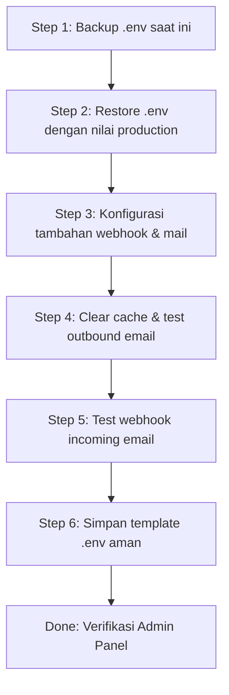

# Analisis Email Inbox (info@bizmark.id) — Root Cause & Rencana Perbaikan

> **Environment**: PRODUCTION (APP_ENV=local tapi seharusnya production)
> **Tanggal Analisis**: 2026-04-30

## Ringkasan Eksekutif

Fitur email menerima dan mengirim pesan di info@bizmark.id mengalami kegagalan total karena **file `.env` di production telah tertimpa dengan nilai development/local** yang menggunakan placeholder, bukan konfigurasi production yang sebenarnya.

---

## 🔍 Perbandingan `.env` — Current vs Backup Production

| Parameter | Current `.env` (Rusak - LIVE) | Backup `.env.failed-pgsql` (Seharusnya) |
|-----------|------------------------------|----------------------------------------|
| `APP_ENV` | `local` ❌ | `production` ✅ |
| `MAIL_MAILER` | `log` ❌ | `smtp` ✅ |
| `MAIL_HOST` | `smtp.brevo.com` ❌ | `smtp-relay.brevo.com` ✅ |
| `MAIL_USERNAME` | `brevo@example.com` ❌ | `9b8609001@smtp-brevo.com` ✅ |
| `MAIL_PASSWORD` | `brevopass` ❌ | `xsmtpsib-...` (valid API key) ✅ |
| `MAIL_FROM_ADDRESS` | `test@bizmark.id` ❌ | `noreply@bizmark.id` ✅ |
| `MAIL_FROM_NAME` | `Test` ❌ | `Bizmark` ✅ |
| `SESSION_DRIVER` | `redis` (beda) | `database` |
| `QUEUE_CONNECTION` | `redis` (beda) | `database` |
| `CACHE_STORE` | `redis` (beda) | `database` |
| `REDIS_CLIENT` | `predis` (beda) | `phpredis` |

---

## 🚨 Akar Masalah

### Masalah 1 (KRITIS): `.env` Tertimpa Nilai Development di Production
- File `.env` saat ini berisi konfigurasi **local development** (`APP_ENV=local`)
- `MAIL_MAILER=log` → Semua email **hanya ditulis ke storage/logs**, tidak pernah dikirim via SMTP Brevo
- Kredensial SMTP Brevo adalah **placeholder** (`brevo@example.com` / `brevopass`)
- **Ini menjelaskan kenapa `.env` sering berubah** setelah perbaikan — karena ada proses/cache yang mengembalikan ke versi development

### Masalah 2 (SEDANG): `mail.contact_email` Tidak Terdefinisi
- [`ContactController.php:52`](app/Http/Controllers/ContactController.php:52): `config('mail.contact_email', 'info@bizmark.id')`
- Key tidak ada di [`config/mail.php`](config/mail.php) → fallback ke `info@bizmark.id` (beruntung benar)

### Masalah 3 (SEDANG): Contact Form Tidak Simpan ke Database
- [`ContactController::submit()`](app/Http/Controllers/ContactController.php:25) hanya kirim email, tanpa DB backup
- Dengan `MAIL_MAILER=log`, data hilang tanpa jejak

### Masalah 4 (RENDAH): Webhook Signature & Replay Protection
- `EMAIL_WEBHOOK_SECRET` kosong, `REQUIRE_SIGNATURE=false` → aman untuk sekarang
- Tapi replay protection mungkin blokir jika Cloudflare Worker tidak kirim header `X-Timestamp`/`X-Nonce`

---

## 📋 Rencana Perbaikan — 6 Langkah



### Step 1: Backup `.env` Saat Ini
```bash
cp .env .env.backup.$(date +%Y-%m-%d_%H%M)
```

### Step 2: Restore `.env` dengan Nilai Production
Berdasarkan [`.env.failed-pgsql.2026-04-19_1151`](.env.failed-pgsql.2026-04-19_1151), perbaiki:

| Baris | Ubah Dari | Menjadi |
|-------|-----------|---------|
| 2 | `APP_ENV=local` | `APP_ENV=production` |
| 48 | `MAIL_MAILER=log` | `MAIL_MAILER=smtp` |
| 50 | `MAIL_HOST=smtp.brevo.com` | `MAIL_HOST=smtp-relay.brevo.com` |
| 52 | `MAIL_USERNAME=brevo@example.com` | `MAIL_USERNAME=9b8609001@smtp-brevo.com` |
| 53 | `MAIL_PASSWORD=brevopass` | `MAIL_PASSWORD=xsmtpsib-...` (dari backup) |
| 54 | `MAIL_FROM_ADDRESS=test@bizmark.id` | `MAIL_FROM_ADDRESS=noreply@bizmark.id` |
| 55 | `MAIL_FROM_NAME=Test` | `MAIL_FROM_NAME=Bizmark` |

### Step 3: Konfigurasi Webhook & Mail Tambahan
- Pastikan semua `EMAIL_WEBHOOK_*` settings tetap ada di `.env`
- Tambahkan `MAIL_ENCRYPTION=tls` jika belum ada

### Step 4: Clear Cache & Test Outbound
```bash
php artisan optimize:clear
php artisan config:cache
```

Test contact form via:
```bash
curl -X POST https://bizmark.id/contact \
  -H "Content-Type: application/json" \
  -H "X-Requested-With: XMLHttpRequest" \
  -H "Accept: application/json" \
  -d '{
    "name": "Test User",
    "email": "test@example.com",
    "phone": "08123456789",
    "subject": "Test dari analisis email",
    "message": "Testing apakah email notifikasi terkirim"
  }'
```

### Step 5: Test Webhook Incoming Email
```bash
curl -X POST https://bizmark.id/webhook/email/test \
  -H "Content-Type: application/json" \
  -H "Accept: application/json" \
  -H "X-Timestamp: $(date +%s)" \
  -H "X-Nonce: $(uuidgen || echo 'test-nonce-1234567890123456')" \
  -d '{
    "from": "pengirim@example.com",
    "to": "info@bizmark.id",
    "subject": "Test Email via Webhook",
    "text": "Ini adalah test email.",
    "html": "<p>Ini adalah <strong>test email</strong>.</p>",
    "message_id": "test-'$(date +%s)'"
  }'
```

### Step 6: Buat Template `.env` yang Aman
Simpan sebagai [`.env.production.template`](.env.production.template) dengan nilai production.
File ini bisa jadi referensi jika `.env` tertimpa lagi di masa depan.

---

## 🛠 File yang Terlibat

| File | Peran | Tindakan |
|------|-------|----------|
| [`.env`](.env) | Konfigurasi environment | **Perbaiki** — restore nilai production |
| [`.env.failed-pgsql.2026-04-19_1151`](.env.failed-pgsql.2026-04-19_1151) | Backup konfigurasi benar | **Referensi** — sumber nilai production |
| [`config/mail.php`](config/mail.php) | Konfigurasi mailer | Review — tambah key `contact_email` jika perlu |
| [`config/email_webhook.php`](config/email_webhook.php) | Konfigurasi webhook | Review — sudah OK |
| [`app/Http/Controllers/ContactController.php`](app/Http/Controllers/ContactController.php) | Handler contact form | Review — tambah DB storage (opsional) |
| [`app/Http/Controllers/EmailWebhookController.php`](app/Http/Controllers/EmailWebhookController.php) | Handler webhook email | Review — sudah OK |
| [`app/Http/Middleware/EnsureEmailWebhookReplayProtection.php`](app/Http/Middleware/EnsureEmailWebhookReplayProtection.php) | Middleware anti-replay | Review — pastikan kompatibel dengan Cloudflare Worker |
